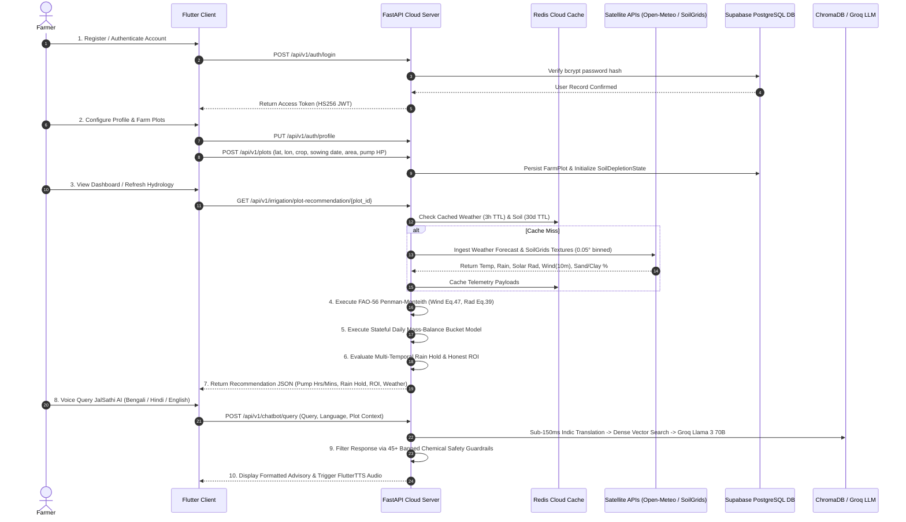
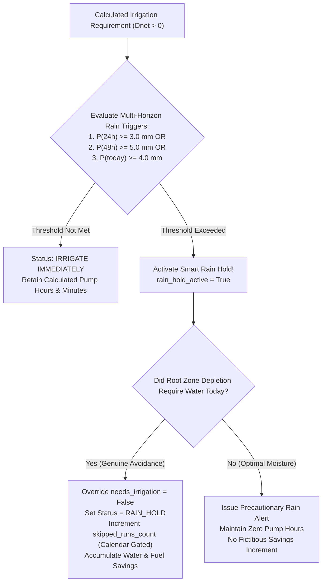
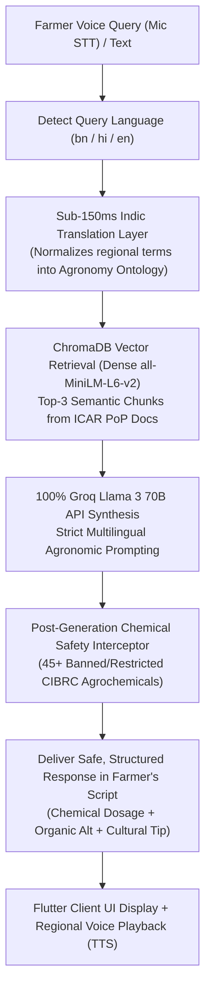
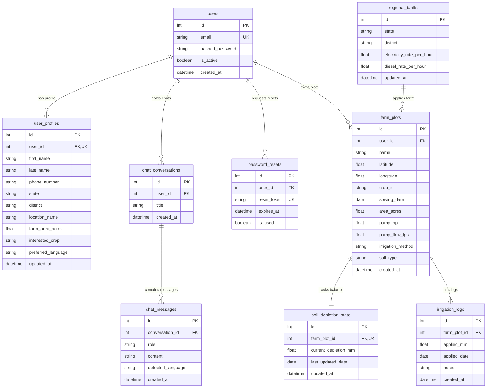

# 🌾 JalDrishti AI: Precision Agricultural Hydrology & Intelligent Field Advisory Platform

## 📑 Master Architecture, User Journey Workflow & Technical Reference Guide

---

## 👥 Core Contributors & Project Maintainers

| Contributor | Role & Specialization | Contact & Profiles |
|:---|:---|:---|
| **Arpan Pramanik** | **Lead Architect & Full-Stack Hydrology Engineer**<br/>• Core FAO-56 Penman-Monteith calculation engine & daily mass-balance bucket model.<br/>• FastAPI asynchronous backend architecture, Redis caching, and persistent state management.<br/>• System performance benchmarking, security hardening, and end-to-end integration. | 📧 [pramanikarpan089@gmail.com](mailto:pramanikarpan089@gmail.com)<br/>🐙 [GitHub: @arpanpramanik2003](https://github.com/arpanpramanik2003/) |
| **Diya Chanda** | **Lead AI/ML Engineer & Mobile Systems Architect**<br/>• JalSathi AI RAG pipeline, dense vector embeddings (`all-MiniLM-L6-v2`), and Groq Llama 3 70B integration.<br/>• Cross-platform Flutter client architecture, responsive UI/UX, and 5-Tab Analytics Suite.<br/>• Agronomic safety guardrails (banned chemical interceptors) and multilingual voice interfaces (STT/TTS). | 📧 [chandasujata01@gmail.com](mailto:chandadiya2004/)<br/>🐙 [GitHub: @chandadiya2004](https://github.com/chandadiya2004/) |

---

## 📖 Chapter 1: Executive Summary, Agricultural Mission & System Overview

### 1.1 The Indian Agricultural Hydrology Context
Agriculture sustains over $50\%$ of the Indian workforce, yet smallholder and marginal farmers ($< 2$ hectares of land) encounter acute systemic challenges in irrigation and water resource management:

1. **Water Waste via Unmetered Flood Irrigation**: Over $80\%$ of cultivated land in India relies on uncalibrated surface flooding. Inundating fields without measuring crop water requirements induces **root zone hypoxia** (canopy suffocation due to oxygen depletion in saturated soil pores), accelerates topsoil erosion, and leaches essential macro/micronutrients below the root zone.
2. **Financial Depletion & Rural Grid Strain**: Farmers operate diesel and electric pumps on arbitrary, fixed schedules (e.g., 3 to 6 hours daily). Operating costs average ₹$80.0/\text{hour}$ (and higher under diesel generator sets), causing unnecessary operational expenditures and placing heavy peak-load strain on rural energy infrastructure.
3. **Monsoonal Volatility & Ill-Timed Pumping**: Unpredictable weather shifts frequently lead farmers to irrigate fields immediately before monsoonal downpours, causing severe waterlogging, disease outbreaks, crop rot, and wasted fuel expenditure.
4. **The Hardware Prohibitive Barrier**: Commercial precision irrigation systems mandate hardware installations—in-situ capacitive soil moisture probes, automated tipping-bucket rain gauges, and cellular telemetry nodes. With deployment costs exceeding ₹$15,000$ to ₹$40,000$ per plot, these solutions remain economically inaccessible to the vast majority of smallholder farming families.

```text
┌───────────────────────────────────────────────────────────────────────────────────────────┐
│                                   THE JALDRISHTI VISION                                   │
│                                                                                           │
│   Traditional Agriculture                                   JalDrishti AI Platform        │
│   ❌ Fixed watering schedules                              ✅ FAO-56 Scientific Hydrology │
│   ❌ Over-watering & root hypoxia                          ✅ Exact Pump Hours & Minutes  │
│   ❌ Wasted fuel (₹80/hr) & water                          ✅ Multi-Temporal Rain Holds   │
│   ❌ Expensive IoT hardware required                       ✅ Zero-Hardware Remote Sensing│
│   ❌ Hallucinatory AI advice                               ✅ Guardrailed Multilingual RAG│
└───────────────────────────────────────────────────────────────────────────────────────────┘
```

### 1.2 The JalDrishti Solution: Zero-Hardware Precision Technology
**JalDrishti AI** is a zero-hardware-cost, satellite-driven agricultural hydrology and agronomic advisory platform engineered specifically for Indian agro-ecological zones. By synthesizing real-time Open-Meteo satellite weather telemetry, ISRIC SoilGrids pedological texture data ($0.05^\circ$ spatial binning with static fallback presets), and ICAR Package of Practices (PoP) crop stage curves into standard **FAO-56 Penman-Monteith physical equations**, JalDrishti provides:

- **Equipment-Mapped Pumping Schedules**: Translates root zone water depletion ($D_i$) directly into actionable pump durations in **Hours and Minutes**, tailored to the farmer's pump horsepower (HP), discharge rate ($Q_{\mathrm{pump}}$ in L/s), field acreage ($A_{\mathrm{sqm}}$), and application method efficiency ($\eta$).
- **Multi-Temporal Smart Rain Hold Engine**: Continuously evaluates multi-horizon precipitation forecast thresholds ($P_{24\mathrm{h}} \ge 3.0\mathrm{~mm}$, $P_{48\mathrm{h}} \ge 5.0\mathrm{~mm}$, or $P_{\mathrm{today}} \ge 4.0\mathrm{~mm}$) to suppress redundant pump runs, prevent waterlogging, and protect farm operating margins.
- **Persistent Daily Mass-Balance State**: Maintains field moisture continuity across days using a dedicated database model (`SoilDepletionState`), preventing rolling calculation amnesia.
- **Auditable Farmer ROI Telemetry**: Calculates honest cumulative water volume saved ($\mathrm{Liters}$ / $\mathrm{kL}$), pump operational hours avoided, financial expenditures conserved (₹ INR, mapped to regional tariffs), and carbon emissions avoided ($\mathrm{kg\ CO}_2$), with zero fictitious baseline offsets.
- **5-Tab Field Analytics Suite**: Delivers dynamic visual dashboards for weather forecasts, daily water balance trends, actionable hydration insights, water satisfaction indices ($WSI$), and historical irrigation logs.
- **JalSathi AI Multilingual Agronomy Companion**: A voice/text assistant running entirely on the Groq Llama 3 70B API, equipped with preliminary sub-150ms Indic translation, dense vector retrieval (`all-MiniLM-L6-v2` in ChromaDB), and strict safety guardrails intercepting 45+ banned/restricted agrochemicals.

---

## 🏗️ Chapter 2: System Architecture & Technology Stack

JalDrishti AI is architected as an asynchronous, multi-tier distributed microservices platform designed for sub-second response times, operational resilience under spotty connectivity, and rigorous computational integrity:

```text
                                ┌──────────────────────────────────┐
                                │   Flutter Cross-Platform Client  │
                                │  (Dart 3.x, Provider, CustomUI)  │
                                └────────────────┬─────────────────┘
                                                 │ REST API (JSON / JWT Bearer)
                                                 ▼
                                ┌──────────────────────────────────┐
                                │    Python FastAPI Cloud Server   │
                                │   (AsyncIO, Uvicorn, PyDantic v2)│
                                └──────┬────────────────────┬──────┘
                                       │                    │
             ┌─────────────────────────┴──────┐          ───┴────────────────────────────┐
             │                                │         │                                │
             ▼                                ▼         ▼                                ▼
┌─────────────────────────┐     ┌──────────────────┐ ┌───────────────────┐    ┌──────────────────┐
│  Supabase PostgreSQL    │     │   Redis Cloud    │ │ ChromaDB Vector DB│    │ Groq LLM API     │
│ (SQLAlchemy 2.0 Async)  │     │(redis.asyncio DB)│ │(all-MiniLM-L6-v2) │    │ (Llama 3 70B)    │
└─────────────────────────┘     └──────────────────┘ └───────────────────┘    └──────────────────┘
```

### 2.1 Layer-by-Layer Technology Matrix

| Layer / Subsystem | Technology | Purpose & Architectural Function |
|---|---|---|
| **Mobile Client** | **Flutter SDK (Dart 3.x)** | Fast, responsive cross-platform client UI for Android and iOS devices. |
| **State Management** | **Provider Pattern** | Reactive state container architecture (`AuthProvider`, `FarmPlotProvider`, `IrrigationProvider`, `ChatProvider`, `NotificationProvider`). |
| **Network Interceptor** | **Dart Custom HTTP Client** | In-flight token injection, automatic 401 token refresh interception, and uniform error handling. |
| **Data Visualization** | **CustomPainter & Google Fonts** | Renders dynamic Y-axis bar charts, spline curves, and progress gauges without heavy third-party charting bloat. |
| **Speech Engine** | **SpeechToText & FlutterTTS** | Voice input capture (STT) and native regional accent audio response playback (TTS) tuned to 0.45× conversational speed. |
| **Cloud Backend API** | **Python 3.11 & FastAPI** | Fully asynchronous REST backend handling external telemetry fetching, FAO-56 scientific calculations, and RAG execution. |
| **Server Runtime** | **Uvicorn & AsyncIO** | Non-blocking ASGI web server supporting high concurrent farmer requests with zero blocking thread pool starvation. |
| **Primary Database** | **Supabase PostgreSQL** | Relational cloud database hosting user credentials, profiles, farm plots, irrigation logs, depletion states, and regional tariffs. |
| **Database ORM** | **SQLAlchemy 2.0 (`asyncpg`)** | True asynchronous connection pooling and session management with PyDantic v2 schema serialization. |
| **High-Speed Cache** | **Redis Cloud (`redis.asyncio`)** | Caches Open-Meteo weather forecasts (3-hour TTL) and ISRIC soil physics (30-day TTL with $0.05^\circ$ coordinate binning). |
| **AI Vector Store** | **ChromaDB 1.5.9** | Dense vector store indexing ICAR Package of Practices guides using `sentence-transformers/all-MiniLM-L6-v2` embeddings. |
| **Generative LLM Engine**| **Groq API (Llama 3 70B)** | High-throughput agronomic reasoning, multilingual chat generation, and CIBRC chemical safety rule compliance. |
| **Remote Sensing Feeds** | **Open-Meteo & ISRIC SoilGrids**| Real-time hourly/daily weather forecasts and topsoil sand/clay physical texture percentages. |

---

## 🔄 Chapter 3: End-to-End Operational Lifecycle (The Complete User Journey)

The operational lifecycle of JalDrishti AI spans onboarding, satellite ingestion, physical hydrology calculation, rain hold validation, analytics, and intelligent voice-assisted agronomy:



---

### 3.1 Phase 1: User Onboarding, Profile & Farm Plot Registration

#### Step 1.1: Security Registration & Authentication
- **Endpoints**: `POST /api/v1/auth/register`, `POST /api/v1/auth/login`, `POST /api/v1/auth/forgot-password`, `POST /api/v1/auth/reset-password` (`app/api/v1/endpoints/auth.py`).
- **Cryptographic Security**: Passwords hashed using **bcrypt** ($12$ rounds). Tokens issued as **JWT Access Tokens** (`HS256`) containing subject identity (`sub`) and expiration claims (`exp`).
- **Client Resilience**: The Flutter client's `ApiService` employs a custom HTTP interceptor that detects `401 Unauthorized` responses, attempts an in-flight token refresh, and retries queued requests seamlessly.

#### Step 1.2: Farmer Profile Setup
- **Endpoint**: `PUT /api/v1/auth/profile`
- **Fields Captured**: `first_name`, `last_name`, `phone_number`, `state`, `district`, `location_name` (e.g., *"Burdwan, West Bengal"*), `farm_area_acres`, `interested_crop`, `preferred_language` (`en`, `bn`, `hi`).

#### Step 1.3: Farm Plot & Equipment Profile Onboarding
- **Endpoint**: `POST /api/v1/plots/` (`app/api/v1/endpoints/farm_plots.py`)
- **Parameters Onboarded**:
  - `name`: Human-readable field identifier (e.g., *"South Canal Paddy"*).
  - `latitude` & `longitude`: Exact decimal GPS coordinates.
  - `crop_id`: Target crop key (`paddy_rice`, `potato`, `wheat`, `mustard`, `maize`).
  - `sowing_date`: Planting calendar date used for dynamic phenological stage tracking.
  - `area_acres`: Field size in acres ($1\text{ acre} = 4046.86\text{ m}^2$).
  - `pump_hp`: Motor horsepower rating.
  - `pump_flow_lps`: Volumetric discharge rate ($Q_{\mathrm{pump}}$ in Liters/sec).
  - `irrigation_method`: Application efficiency profile (`drip`: $\eta = 0.90$, `sprinkler`: $\eta = 0.75$, `flood`: $\eta = 0.50$).
  - `soil_type`: Preset or detected texture (`sandy_loam`, `loam`, `clay_loam`, `silty_clay`, `heavy_clay`).

---

### 3.2 Phase 2: Real-time Hydrological Science Engine (FAO-56 Pipeline)

```text
┌───────────────────────────────────────────────────────────────────────────────────────────┐
│                              FAO-56 HYDROLOGICAL PIPELINE                                 │
│                                                                                           │
│  [1. Telemetry Ingestion] ─> [2. FAO-56 ETo Engine] ──> [3. Dynamic Kc(t) & ETc Demand]   │
│                                (Eq. 47 Wind / Eq. 39 Rad)                │                │
│                                                                          │                │
│  [4. Soil Pedotransfer] ───> [5. Root Zone TAW & RAW] ───────────────────┤                │
│                                                                          ▼                │
│  [7. Equipment Runtime] <── [Gross Depth Dgross] <── [6. Persistent State Bucket Model Di]│
│     (Hours & Mins)             (Adjusted for η)              (SoilDepletionState DB Table)│
└───────────────────────────────────────────────────────────────────────────────────────────┘
```

#### Step 2.1: Satellite Telemetry Ingestion & Smart Caching
- **Open-Meteo Weather API**: Retrieves hourly/daily forecast data ($T_{\mathrm{max}}, T_{\mathrm{min}}, \mathrm{RH}, R_s, u_{10}, P$). Cached asynchronously in Redis Cloud (`weather:{lat}:{lon}`) with a **3-hour TTL**.
- **ISRIC SoilGrids API**: Retrieves topsoil Sand % and Clay %. To accommodate the API's global spatial resolution and prevent upstream rate-limiting, queries are **binned to $0.05^\circ$ (~5.5 km) grid intervals** and cached in Redis Cloud (`soil:{round(lat,2)}:{round(lon,2)}`) with a **30-day TTL**. If upstream is unreachable, fallback to standard ICAR soil texture presets occurs automatically.
- **ICAR Crop Coefficients**: Loads growth stage lengths ($L_{\mathrm{ini}}, L_{\mathrm{dev}}, L_{\mathrm{mid}}, L_{\mathrm{late}}$), basal $K_c$ values, and maximum rooting depth $Z_{r,\mathrm{max}}$ from `app/engine/crop_coefficients.json`.

#### Step 2.2: Reference Evapotranspiration ($ET_0$) Calculation
$ET_0$ quantifies the atmospheric evaporative demand of an extensive, standardized green grass reference surface ($0.12\mathrm{~m}$ crop height, surface resistance $70\mathrm{~s/m}$, albedo $0.23$), completely independent of soil parameters.

$$\mathbf{ET_0 = \frac{0.408 \Delta (R_n - G) + \gamma \frac{900}{T + 273} u_2 (e_s - e_a)}{\Delta + \gamma (1 + 0.34 u_2)} \quad [\mathrm{mm/day}]}$$

**Critical Physical Corrections Implemented in JalDrishti**:
1. **Logarithmic Wind Speed Reduction (FAO-56 Eq. 47)**: Weather forecasts supply wind speed at $10\mathrm{~m}$ elevation ($u_{10}$). JalDrishti converts this to standard $2\mathrm{~m}$ surface wind speed ($u_2$):
   $$u_2 = u_{10} \times \frac{4.87}{\ln(67.8 \times 10 - 5.42)} \approx u_{10} \times 0.748$$
2. **Stefan-Boltzmann Net Longwave Radiation ($R_{nl}$, FAO-56 Eq. 39)**:
   $$R_{nl} = \sigma \left[ \frac{T_{\mathrm{max},K}^4 + T_{\mathrm{min},K}^4}{2} \right] \left(0.34 - 0.14 \sqrt{e_a}\right) \left(1.35 \frac{R_s}{R_{so}} - 0.35\right)$$
   Net radiation is then rigorously computed as $R_n = R_{ns} - R_{nl}$ (where $R_{ns} = 0.77 R_s$).
3. **Daily Soil Heat Flux**: For daily calculation steps, $G \approx 0.0\mathrm{~MJ/m}^2/\mathrm{day}$.

#### Step 2.3: Dynamic Crop Coefficient ($K_c$) & Transpiration ($ET_c$)
Crop evapotranspiration under standard conditions is:
$$ET_c(t) = K_c(t) \times ET_0 \quad [\mathrm{mm/day}]$$

**Phenological Boundary Conditions & Interpolation**:
The engine computes `elapsed_days = (today - sowing_date)`.
- **Pre-Sowing Protection**: If `elapsed_days < 0`, stage is flagged `NOT_YET_SOWN`, setting $K_c = 0.0$ and minimal surface root depth $Z_r = 0.10\mathrm{~m}$.
- **Stage 1 (Initial)**: $0 \le \text{days} \le L_{\mathrm{ini}} \implies K_c = K_{c,\mathrm{ini}}$, $Z_r(t) = \max(0.15, Z_{r,\mathrm{max}} \times 0.30)$.
- **Stage 2 (Development)**: $L_{\mathrm{ini}} < \text{days} \le (L_{\mathrm{ini}} + L_{\mathrm{dev}}) \implies$ linear interpolation between $K_{c,\mathrm{ini}}$ and $K_{c,\mathrm{mid}}$, with progressive root zone expansion.
- **Stage 3 (Mid-Season)**: During peak vegetative/reproductive stages, $K_c = K_{c,\mathrm{mid}}$, $Z_r = Z_{r,\mathrm{max}}$.
- **Stage 4 (Late Season)**: Continuous linear decay from $K_{c,\mathrm{mid}}$ to $K_{c,\mathrm{end}}$, maintaining full root depth $Z_r = Z_{r,\mathrm{max}}$.
- **Harvest Overdue Protection**: If `elapsed_days > (lifecycle + 15\text{ days})`, stage is flagged `HARVEST_OVERDUE`, pinning $K_c = K_{c,\mathrm{end}}$ and generating a harvesting reminder.

#### Step 2.4: Soil Moisture Retention & Thresholds
Using topsoil Sand % and Clay %, hydraulic pedotransfer functions derive:
1. **Field Capacity ($\theta_{\mathrm{FC}}$)**:
   $$\theta_{\mathrm{FC}} = 0.10 + 0.0025 \times \mathrm{Clay} + 0.0005 \times (100 - \mathrm{Sand}) \quad [\mathrm{m}^3/\mathrm{m}^3]$$
2. **Permanent Wilting Point ($\theta_{\mathrm{WP}}$)**:
   $$\theta_{\mathrm{WP}} = 0.02 + 0.0020 \times \mathrm{Clay} \quad [\mathrm{m}^3/\mathrm{m}^3]$$
3. **Total Available Water ($TAW$)**:
   $$TAW = 1000 \times (\theta_{\mathrm{FC}} - \theta_{\mathrm{WP}}) \times Z_r(t) \quad [\mathrm{mm}]$$
4. **Readily Available Water ($RAW$) Stress Threshold**:
   $$RAW = p \times TAW \quad [\mathrm{mm}]$$
   *(where $p$ is the crop-specific depletion fraction, typically $0.50$ for field crops, $0.20$ for shallow-rooted potato)*

#### Step 2.5: Persistent Daily Mass-Balance Soil Water Bucket Model
Rather than re-estimating depletion over arbitrary rolling timeframes, JalDrishti persists daily root zone depletion in the `SoilDepletionState` database table:

$$D_i = \max\left(0.0, \, \min\left(TAW, \, D_{i-1} + ET_{c,i} - P_{\mathrm{eff},i} - I_i\right)\right) \quad [\mathrm{mm}]$$

- $D_{i-1}$: Depletion state carried over from yesterday.
- $P_{\mathrm{eff},i}$: Effective rainfall entering the soil matrix, accounting for surface runoff ($P_{\mathrm{eff}} = \min(P \times 0.80, P)$).
- $I_i$: Farmer-logged applied irrigation depth ($D_{\mathrm{gross}} \times \eta$).
- Deep percolation occurs automatically if input water drives depletion below zero ($D_i < 0$).

#### Step 2.6: Decision Boundary & Volumetric Pump Runtime
1. **Trigger Condition**:
   - If $D_i < RAW$: `status = "SOIL MOISTURE OPTIMAL"`, $D_{\mathrm{net}} = 0.0\mathrm{~mm}$, Pump Runtime = `0 Hours 0 Mins`.
   - If $D_i \ge RAW$: `status = "IRRIGATE IMMEDIATELY"`, $D_{\mathrm{net}} = D_i\mathrm{~mm}$.
2. **Gross Depth Adjusted for Irrigation Efficiency**:
   $$D_{\mathrm{gross}} = \frac{D_{\mathrm{net}}}{\eta} \quad [\mathrm{mm}]$$
3. **Volumetric Water Requirement**:
   $$V_{\mathrm{liters}} = D_{\mathrm{gross}} \times A_{\mathrm{sqm}} \quad [\mathrm{Liters}] \quad (\text{where } 1\mathrm{~mm} \times 1\mathrm{~m}^2 = 1\mathrm{~Liter})$$
4. **Pump Duration Conversion**:
   $$T_{\mathrm{seconds}} = \frac{V_{\mathrm{liters}}}{Q_{\mathrm{pump}}}$$
   $$\text{Pump Hours} = \left\lfloor \frac{T_{\mathrm{seconds}}}{3600} \right\rfloor, \quad \text{Pump Minutes} = \mathrm{round}\left( \frac{T_{\mathrm{seconds}} \pmod{3600}}{60} \right)$$

---

### 3.3 Phase 3: Smart Rain Hold Advisory & Cumulative ROI Telemetry



#### Multi-Temporal Rain Hold Triggers:
A Rain Hold override is engaged if any of the following physical criteria are met:
1. **Immediate 24-hour horizon**: $P_{24\mathrm{h}} \ge 3.0\mathrm{~mm}$
2. **Upcoming 48-hour cumulative forecast**: $P_{48\mathrm{h}} \ge 5.0\mathrm{~mm}$
3. **Current day precipitation forecast**: $P_{\mathrm{today}} \ge 4.0\mathrm{~mm}$

#### Honest, Zero-Offset Cumulative ROI Telemetry:
Earlier legacy formulations included arbitrary baseline offsets (e.g. $+3$ or $+4$ runs) that exaggerated farmer savings. JalDrishti calculates **strictly auditable ROI** based on verified rain hold overrides:

1. **Volume Conserved**:
   $$V_{\mathrm{cum}} = D_{\mathrm{gross}} \times A_{\mathrm{sqm}} \times N_{\mathrm{skipped}} \quad [\mathrm{Liters}]$$
2. **Pumping Hours Conserved**:
   $$T_{\mathrm{saved}} = \frac{V_{\mathrm{cum}}}{Q_{\mathrm{pump}} \times 3600} \quad [\mathrm{Hours}]$$
3. **Financial Capital Conserved**:
   $$S_{\mathrm{cum}} = \mathrm{round}(T_{\mathrm{saved}} \times \text{Tariff}) \quad [\mathrm{INR}]$$
   *(Tariff is retrieved dynamically from `RegionalTariff` by state/district, defaulting to ₹$80.0/\text{hr}$)*
4. **Carbon Footprint Avoided**:
   $$E_{\mathrm{CO2}} = \mathrm{round}(T_{\mathrm{saved}} \times 2.8, \, 1) \quad [\mathrm{kg\ CO}_2]$$
   *(Standard diesel/coal-grid pump emission factor of $2.8\mathrm{~kg\ CO}_2/\mathrm{hour}$)*

---

### 3.4 Phase 4: 5-Tab Field Analytics Suite

The mobile client's `AnalyticsScreen` hosts 5 specialized analysis tabs:

1. **Tab 0: Weather Stats (`weather_stats_tab.dart`)**:
   - 6-day forward forecast cards populated directly from `daily_breakdown`.
   - Max/Min temperature, relative humidity %, 2m surface wind speed, precipitation depth, and $ET_0$.
2. **Tab 1: Daily Trends (`daily_trends_tab.dart`)**:
   - High-performance `CustomPainter` visualizer with clear Y-axis scale labels (`0 mm`, `5 mm`, `10 mm`, `15 mm`).
   - Dual-color bar series (Applied Irrigation vs. Natural Rainfall) alongside a smooth cubic spline representing Crop Demand $ET_c$.
   - Interactive daily breakdown card list showing exact daily numeric metrics.
3. **Tab 2: Smart Insights (`smart_insights_tab.dart`)**:
   - Real-time hydration status badge (Optimal / Depletion Stress / Soil Saturation).
   - Dynamic Precision Savings Counter displaying water volume saved ($\mathrm{kL}$) and financial savings (₹ INR).
   - Active growth stage indicators and contextual Smart Rain Hold advisory cards.
4. **Tab 3: Water Balance (`water_balance_tab.dart`)**:
   - Water Satisfaction Index ($WSI$):
     $$WSI = \frac{\text{Applied Water} + \text{Effective Rain}}{ET_c} \times 100\%$$
   - Volumetric comparison cards evaluating Applied Irrigation ($\mathrm{kL}$), Rainfall Inflow ($\mathrm{kL}$), and Transpiration Loss ($\mathrm{kL}$).
5. **Tab 4: History Logs (`history_logs_tab.dart`)**:
   - Fetches chronological irrigation runs via `GET /api/v1/irrigation/history/{plot_id}`.
   - Includes an active **"+ Log Water Run"** modal allowing farmers to record real pump sessions directly into the persistent database.

---

### 3.5 Phase 5: JalSathi AI Multilingual Agronomy Companion

JalSathi AI is an intelligent RAG-powered voice and text assistant engineered to deliver verified, actionable crop management advice in native Indian languages (Bengali বাংলা, Hindi हिंदी, English):



#### Architectural Distinctions & Safety Guardrails:
1. **100% Groq-Native Pipeline**: Runs exclusively on the ultra-low-latency Groq Llama 3 70B API. All legacy fallback tiers have been cleanly excised.
2. **Dense Vector Embeddings**: Utilizes `sentence-transformers/all-MiniLM-L6-v2` dense vectors stored inside ChromaDB 1.5.9, indexing comprehensive ICAR Package of Practices documentation for paddy, potato, wheat, mustard, and maize.
3. **Sub-150ms Translation Normalization**: Regional farmer queries in Bengali or Hindi are mapped through a lightweight semantic translation layer to align vernacular pest/weed terms with ICAR taxonomic classifications before vector embedding.
4. **Banned Agrochemical Safety Guardrail**: A deterministic post-generation safety layer scans LLM outputs against **45+ banned or severely restricted active ingredients** under India's Central Insecticides Board & Registration Committee (CIBRC) regulations (e.g. *Paraquat*, *Monocrotophos*, *Endosulfan*, *Phorate*, *DDT*). Any detected violation is intercepted and replaced with approved, safe CIBRC alternatives and organic biocontrol solutions (*Trichoderma*, *Pseudomonas*, NSKE).
5. **Standardized 3-Part Output Structure**:
   - 🧪 **Chemical Treatment**: Exact legal active ingredients, approved trade formulations, and per-acre dilution rates.
   - 🌿 **Organic / Biological Alternative**: Sustainable biocontrol agents and botanical preparations.
   - 💡 **Preventive Cultural Practice**: Field sanitation, ridge management, and optimal irrigation timing.

---

### 3.6 Phase 6: Emergency Alerts & Automated Cron Advisory

The platform features an automated asynchronous background cron (`automated_advisory_cron.py`) that operates in tandem with client-side notifications:
- **Daily 06:00 AM Advisory Cron**: Evaluates all registered farm plots across India, fetching updated satellite weather, updating daily depletion state balances, and generating timely pump or rain hold advisories.
- **Microclimate Epidemiological Alerts**: Scans temperature, humidity, and leaf wetness duration against established spore germination models for devastating regional pathogens (e.g., Rice Blast *Magnaporthe oryzae*, Potato Late Blight *Phytophthora infestans*, Mustard Aphid *Lipaphis erysimi*).

---

## 🗄️ Chapter 4: Database Schema & Entity Relationships

The relational database architecture is hosted on **Supabase PostgreSQL** and modeled via **SQLAlchemy 2.0 Async** ORM classes using integer primary keys:



---

## ❓ Chapter 5: System Technical FAQ & Core Engineering QA Matrix

### Q1: "How does JalDrishti differ from conventional weather and farm advisory applications (e.g., Meghdoot, Kisan Suvidha)?"
> **Answer**: Conventional agricultural portals provide generalized, district-level tabular weather summaries or static crop calendars. JalDrishti delivers **plot-specific, volumetric hydraulic engineering**: it computes exact reference evapotranspiration ($ET_0$) via FAO-56 Penman-Monteith, tracks daily root zone soil moisture balances ($D_i$) via persistent database state, and converts millimeter water deficits into equipment-calibrated **Pump Hours and Minutes** specific to the farmer's motor horsepower and flow rate.

### Q2: "How can you estimate soil moisture without deploying physical capacitive IoT sensors?"
> **Answer**: JalDrishti estimates root zone moisture dynamics by pairing global ISRIC SoilGrids pedological texture data ($0.05^\circ$ coordinate binning) with empirical hydraulic pedotransfer functions to establish Field Capacity ($\theta_{\mathrm{FC}}$) and Permanent Wilting Point ($\theta_{\mathrm{WP}}$). A daily mass-balance water bucket model ($D_i = D_{i-1} + ET_c - P_{\mathrm{eff}} - I$) continuously tracks moisture additions and withdrawals. This provides an effective zero-hardware estimation model for smallholders who cannot afford hardware probes, though it represents meteorological-hydrological modeling rather than physical in-situ sensor ground-truthing.

### Q3: "What are the scientific criteria governing the Smart Rain Hold override?"
> **Answer**: The engine evaluates multi-temporal precipitation forecasts using three distinct thresholds:
> 1. $P_{24\mathrm{h}} \ge 3.0\mathrm{~mm}$ (immediate forward rainfall)
> 2. $P_{48\mathrm{h}} \ge 5.0\mathrm{~mm}$ (cumulative 2-day storm risk)
> 3. $P_{\mathrm{today}} \ge 4.0\mathrm{~mm}$ (current calendar day rainfall)
> If any threshold is satisfied, irrigation is suppressed because incoming rain will replenish the root zone. Pumping prior to heavy rainfall drives soil water content past saturation, triggering root asphyxiation and wasting pump electricity/diesel costs.

### Q4: "How does JalSathi AI prevent hallucination of dangerous or prohibited pesticide dosages?"
> **Answer**: JalSathi AI combines **dense vector RAG retrieval** (`all-MiniLM-L6-v2` indexing official ICAR Package of Practices manuals) with an explicit **post-generation chemical guardrail**. The output stream is parsed against a deterministic blacklist of **45+ banned/restricted chemical active ingredients** under Indian CIBRC statutory guidelines (such as *Paraquat*, *Monocrotophos*, and *Endosulfan*). Any prohibited substance is filtered out and substituted with approved formulations and biological alternatives before reaching the user.

### Q5: "Why is $ET_0$ computed independently of soil texture and crop type?"
> **Answer**: Under the internationally standardized FAO-56 formulation, $ET_0$ represents the **pure evaporative power of the atmosphere** over an idealized, well-watered grass surface. Atmospheric parameters (radiation, temperature, vapor pressure deficit, and wind speed) are atmospheric phenomena that do not depend on what is growing beneath them or the soil composition. Soil physical properties enter downstream in calculating the soil water reservoir capacity ($TAW, RAW$), and crop parameters enter through the dynamic coefficient $K_c(t)$.

### Q6: "How are boundary conditions handled for unplanted plots or overgrown crops?"
> **Answer**: The engine verifies `elapsed_days = (today - sowing_date)` against the crop's developmental lifecycle:
> - If `elapsed_days < 0`, the field is assigned the `NOT_YET_SOWN` state, clamping $K_c = 0.0$ and root depth to $0.10\mathrm{~m}$.
> - If `elapsed_days` exceeds the cumulative lifecycle plus 15 buffer days, the state is clamped to `HARVEST_OVERDUE`, maintaining $K_c = K_{c,\mathrm{end}}$ and notifying the farmer to harvest.

### Q7: "Why is effective precipitation ($P_{\mathrm{eff}}$) computed with an 80% reduction coefficient?"
> **Answer**: Not all satellite-measured precipitation infiltrates the crop root zone. Intense monsoonal rainfall frequently exceeds soil infiltration capacity, producing surface runoff. Additionally, canopy interception and rapid deep percolation below shallow root zones cause water loss. Applying $P_{\mathrm{eff}} = \min(P \times 0.80, P)$ accounts for these hydraulic realities according to FAO-56 empirical guidelines.

### Q8: "What does the Water Satisfaction Index ($WSI$) indicate in Tab 3 of Field Analytics?"
> **Answer**: $WSI$ evaluates the balance between total water delivered to the field and actual crop physiological demand over the monitoring window:
> $$WSI = \frac{\text{Applied Irrigation} + \text{Effective Rainfall}}{ET_c} \times 100\%$$
> - **$90\% - 110\%$**: Optimal physiological hydration.
> - **$< 80\%$**: Water deficit stress; risk of yield penalty.
> - **$> 130\%$**: Over-saturation; potential for nutrient leaching and root zone hypoxia.

---

## 📌 Summary Code Directory Index

| Subsystem Module | Backend Python Code | Mobile Flutter Code |
|---|---|---|
| **User Authentication & Profiles** | `app/api/v1/endpoints/auth.py`<br/>`app/schemas/user_schema.py` | `lib/core/services/api_service.dart`<br/>`lib/providers/auth_provider.dart`<br/>`lib/screens/login_screen.dart` |
| **Farm Plot Management** | `app/api/v1/endpoints/farm_plots.py`<br/>`app/schemas/farm_plot_schema.py` | `lib/providers/farm_plot_provider.dart`<br/>`lib/screens/add_edit_farm_plot_screen.dart` |
| **FAO-56 Hydrological Engine** | `app/engine/penman_monteith.py`<br/>`app/engine/water_bucket_model.py` | `lib/providers/irrigation_provider.dart`<br/>`lib/widgets/dashboard_pump_card.dart` |
| **Smart Rain Hold & ROI Telemetry** | `app/api/v1/endpoints/irrigation.py`<br/>`app/core/constants.py` | `lib/widgets/smart_rain_hold_card.dart`<br/>`lib/widgets/farmer_roi_savings_card.dart` |
| **5-Tab Field Analytics Suite** | `app/api/v1/endpoints/irrigation.py` | `lib/screens/analytics_screen.dart`<br/>`lib/screens/analytics/*.dart` |
| **JalSathi AI Multilingual Assistant** | `app/services/rag_service.py`<br/>`app/services/vector_search_service.py` | `lib/providers/chat_provider.dart`<br/>`lib/screens/chat_screen.dart` |
| **Emergency Alerts & Background Cron** | `app/services/automated_advisory_cron.py`<br/>`app/engine/pest_disease_engine.py` | `lib/providers/notification_provider.dart`<br/>`lib/core/services/notification_service.dart` |
| **Data Ingestion & Caching** | `app/services/weather_service.py`<br/>`app/services/soilgrids_service.py`<br/>`app/services/cache_service.py` | N/A (Cloud Backend Microservices) |
