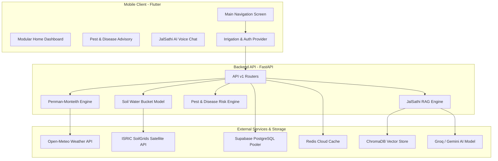

# 🌾 JalDrishti (जलदृष्टि) – AI-Powered Precision Agronomy & Hydrological Irrigation Engine

<p align="center">
  <a href="https://flutter.dev"></a>
  <a href="https://fastapi.tiangolo.com"></a>
  <a href="https://python.org"></a>
  <a href="https://supabase.com"></a>
  <a href="https://redis.io"></a>
  <a href="https://trychroma.com"></a>
</p>

---

## 📌 Executive Summary

**JalDrishti (जलदृष्टि)** is a state-of-the-art, climate-smart agronomy and precision irrigation advisory platform tailored for Indian agriculture. Combining **FAO-56 Penman-Monteith Evapotranspiration modeling**, **SoilGrids high-resolution satellite soil physics**, real-time **Open-Meteo satellite meteorology**, and **RAG-enhanced Multilingual AI (JalSathi AI)**, JalDrishti optimizes water usage, eliminates pump electricity/diesel waste, protects crops from microclimate disease outbreaks, and tracks cumulative farmer financial savings (ROI).

---

## 🔥 Key Features

### 💧 1. FAO-56 Penman-Monteith Hydrological Engine
- Computes daily **Reference Evapotranspiration ($ET_0$)** using net solar radiation, air temperature, relative humidity, and 2-meter wind speed.
- Dynamic **Crop Coefficient ($K_c$)** scaling across 4 distinct agronomic growth stages (Initial, Crop Dev, Mid-Season, Late-Season).
- Calculates exact **Root Depth ($Z_r$)** expansion and Total Available Water ($TAW$).
- Computes practical **Pump Operation Duration** (Hours & Minutes) based on field size (Acres), pump rating (HP), and flow rate ($L/\text{sec}$).

### 🌧️ 2. Smart Rain Hold Warning & Cost Savings Engine
- Inspects upcoming **24–48 hour satellite precipitation forecasts**.
- Automatically activates **RAIN HOLD** when upcoming rainfall $\ge 5.0\text{ mm}$, overriding unnecessary pumping.
- Prevents crop waterlogging, root asphyxiation, and saves **₹150–₹500 per skipped irrigation run**.

### 📊 3. Farmer Impact & Cumulative ROI Tracker
- Real-time cumulative telemetry tracking total **Liters of Water Saved**, **Pump Hours Saved**, **Money Saved (₹ INR)**, **$CO_2$ Emissions Reduced (kg)**, and **Skipped Pump Runs**.

### 🐛 4. Weather-Driven Pest & Disease Advisory
- Evaluates ambient temperature, relative humidity, and rain hours against pathogen proliferation thresholds.
- Predicts early-stage risks for critical Indian crops:
  - 🌾 **Paddy**: Blast (*Magnaporthe oryzae*), Sheath Blight (*Rhizoctonia solani*)
  - 🥔 **Potato**: Late Blight (*Phytophthora infestans*)
  - 🌾 **Wheat**: Yellow Rust (*Puccinia striiformis*)
  - 🌻 **Mustard**: Aphid Infestation (*Lipaphis erysimi*)
  - 🌽 **Maize**: Fall Armyworm (*Spodoptera frugiperda*)
- Provides actionable **Chemical Dosages** (e.g., Tricyclazole, Mancozeb) and **Organic Bio-Pesticide Treatments** (e.g., Neem Oil, *Pseudomonas fluorescens*).

### 🤖 5. JalSathi AI – Multilingual RAG Agronomy Voice Assistant
- Powered by **Retrieval-Augmented Generation (RAG)** over ICAR & State Agricultural University **Package of Practices (PoP)** documents.
- Integrated **ChromaDB Vector Store** with HuggingFace embeddings (`all-MiniLM-L6-v2`).
- **Voice-to-Text (STT)** with real-time **Audio Decibel Motion Animation** on the mic button.
- **Text-to-Speech (TTS)** voice read-aloud buttons on AI responses in native Bengali (`bn-IN`), Hindi (`hi-IN`), and English (`en-US`).
- Fully localized **Multi-lingual UI** (Bengali, Hindi, English) including greetings, companion subtitles, and agronomic suggestions.
- Multi-tier Fallback chain (Groq Llama-3-70B $\rightarrow$ Gemini 1.5 Flash $\rightarrow$ Local Knowledge Engine).

---

## 🏗️ System Architecture



---

## 🛠️ Technology Stack

| Component | Technology | Purpose |
|---|---|---|
| **Mobile App** | Flutter 3.24+, Dart | Cross-platform Android/iOS client with responsive design system |
| **Backend Framework** | FastAPI, Uvicorn | Async Python 3.11 REST API engine |
| **Database** | PostgreSQL (Supabase Transaction Pooler) | Relational persistence for users, farm plots, and logs |
| **Caching Layer** | Redis Cloud | High-speed cache for Open-Meteo weather JSON and soil data |
| **Vector DB** | ChromaDB, HuggingFace Transformers | Vector embeddings for ICAR agronomic RAG knowledge |
| **LLM Inference** | Groq API (Llama-3-70B) / Google Gemini | Multilingual conversational reasoning |
| **Weather Feed** | Open-Meteo API | Real-time & 6-day solar radiation, temp, humidity, wind |
| **Soil Intelligence** | ISRIC SoilGrids API | Global 250m satellite clay & sand soil texture maps |

---

## 📁 Repository Structure

```text
jaldrishti/
├── README.md                           # Master Project Documentation
├── docs/                               # Comprehensive Technical Specifications
│   ├── 01_jalsathi_ai.md               # RAG Architecture & AI Chat Engine
│   ├── 02_penman_monteith_hydrology.md # FAO-56 Hydrological Equations & Bucket Model
│   ├── 03_smart_rain_hold_and_roi.md   # Rain Hold Forecasting & ROI Math
│   ├── 04_weather_pest_advisory.md     # Agronomic Pathogen Threshold Rules
│   └── 05_system_architecture_and_db.md# Supabase PostgreSQL, Redis & FastAPI Setup
│
├── jaldrishti-backend/                 # Python FastAPI Backend
│   ├── app/
│   │   ├── api/v1/endpoints/           # API Endpoint Handlers (irrigation, crops, auth)
│   │   ├── engine/                     # Hydrological & Pest Science Algorithms
│   │   ├── models/                     # SQLAlchemy Database Models
│   │   ├── schemas/                    # Pydantic Schemas
│   │   └── services/                   # Open-Meteo, SoilGrids, RAG & Redis Services
│   ├── requirements.txt
│   └── main.py
│
└── jaldrishti_mobile/                  # Flutter Mobile Application
    ├── lib/
    │   ├── core/                       # Services, Constants, Theme
    │   ├── providers/                  # Provider State Management
    │   ├── screens/                    # Dashboard, Analytics, Pest Advisory, JalSathi AI
    │   └── widgets/                    # Reusable Cards (Pump, Weather, Timeline, ROI)
    └── pubspec.yaml
```

---

## 🚀 Quick Start & Installation

### 1. Backend Setup (FastAPI)

```bash
# Navigate to backend directory
cd jaldrishti-backend

# Activate virtual environment
venv\Scripts\activate   # On Windows
# source venv/bin/activate  # On Linux/macOS

# Install dependencies
pip install -r requirements.txt

# Start FastAPI Uvicorn server
uvicorn app.main:app --reload --host 0.0.0.0 --port 8000
```
> Server will start at: `http://localhost:8000` (API Docs: `http://localhost:8000/docs`)

### 2. Mobile Client Setup (Flutter)

```bash
# Navigate to mobile app directory
cd jaldrishti_mobile

# Fetch dependencies
flutter pub get

# Run on connected device / emulator
flutter run
```

---

## 📚 Detailed Feature Documentation

For in-depth mathematical formulas, agronomic rules, and architectural blueprints, view the technical guides in [`/docs`](./docs/):

1. 🤖 [**JalSathi AI RAG Architecture**](./docs/01_jalsathi_ai.md) – Vector embeddings, speech-to-text, LLM fallback pipeline.
2. 📐 [**Penman-Monteith Hydrological Engine**](./docs/02_penman_monteith_hydrology.md) – FAO-56 equations, $ET_0$, $K_c$ curve, and bucket depletion model.
3. 🌧️ [**Smart Rain Hold & Farmer ROI Tracker**](./docs/03_smart_rain_hold_and_roi.md) – 48h precipitation forecast inspection and money/water ROI calculations.
4. 🐛 [**Weather-Based Pest Advisory Engine**](./docs/04_weather_pest_advisory.md) – Disease risk modeling, thresholds, and bio-chemical solutions.
5. ⚡ [**System Architecture & DB Pipeline**](./docs/05_system_architecture_and_db.md) – Supabase PostgreSQL, Redis caching, and FastAPI router structure.

---

<p align="center">
  <b>Developed for Farmers | Powered by Science & AI 🌾💧</b>
</p>
