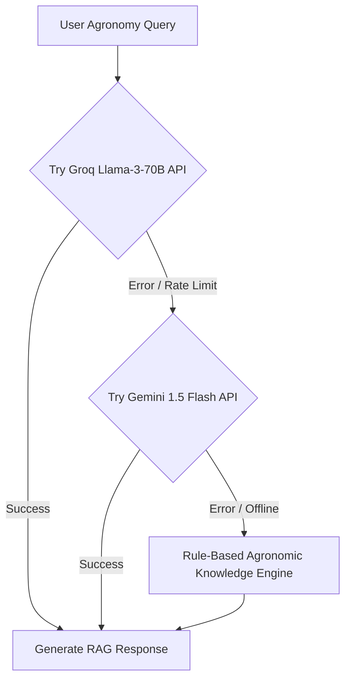

# 🤖 JalSathi AI – RAG-Powered Agronomy Voice & Text Assistant

## 📖 Overview
**JalSathi AI (जलसाथी)** is an intelligent agronomic virtual assistant designed specifically for Indian farmers. It combines **Retrieval-Augmented Generation (RAG)** over verified agricultural university guidelines (ICAR / SAU **Package of Practices**) with multi-lingual Speech-to-Text and Text-to-Speech engines.

```text
┌─────────────────┐     ┌─────────────────────┐     ┌──────────────────────┐
│  Farmer Voice   │ ──> │ Speech-to-Text      │ ──> │ JalSathi RAG Engine  │
│  / Text Input   │     │ (Whisper / Flutter) │     │ (FastAPI Service)    │
└─────────────────┘     └─────────────────────┘     └──────────┬───────────┘
                                                               │
                                                               ▼
┌─────────────────┐     ┌─────────────────────┐     ┌──────────────────────┐
│ Audio Speech    │ <── │ Text-to-Speech      │ <── │ ChromaDB Vector Search│
│ Response Output │     │ (Flutter TTS)       │     │ + Groq Llama-3 LLM   │
└─────────────────┘     └─────────────────────┘     └──────────────────────┘
```

---

## 🛠️ Architecture & RAG Pipeline

### 1. Vector Store & Embeddings
- **Knowledge Base**: ICAR Package of Practices (PoP) covering Paddy, Wheat, Potato, Maize, Mustard, Cotton, Tomato, Sugarcane, Chickpea, and Groundnut.
- **Embedding Model**: `sentence-transformers/all-MiniLM-L6-v2` (384 dimensions).
- **Vector DB**: **ChromaDB** persistent vector store (`jaldrishti-backend/app/chroma_db`).
- **Retrieval Mechanism**: Similarity search with Top-K = 3 context chunks injected into the system prompt.

### 2. Multi-Tier LLM Fallback Pipeline
To ensure high availability even under network congestion or API rate limits, JalSathi implements a multi-tier LLM fallback chain:



1. **Primary LLM**: Groq Llama-3-70B (`llama3-70b-8192`) – Sub-second latency.
2. **Secondary LLM**: Google Gemini 1.5 Flash (`gemini-1.5-flash`).
3. **Tertiary Fallback**: Local Rule-Based Agronomic Knowledge Engine (Offline mode).

---

## 🎙️ Speech & Multilingual Capabilities

### Supported Languages
- 🇮🇳 **Bengali (বাংলা)**: Complete UI & Speech translation.
- 🇮🇳 **Hindi (हिन्दी)**: Native agricultural vocabulary & voice response.
- 🇬🇧 **English**: Technical scientific terminology.

### Audio Pipeline Flow
1. **Audio Capture**: Mobile microphone records farmer query via `speech_to_text` Flutter package.
2. **Context Injection**: Live farm state (Current Crop, Growth Stage, Soil Type, Recent Rainfall) is appended to the RAG prompt context:
   ```json
   {
     "crop": "Paddy Rice",
     "growth_stage": "Mid-Season (Reproductive)",
     "soil_type": "Clay Loam",
     "recent_rain_mm": 8.2
   }
   ```
3. **Synthesis**: Response is spoken back using Flutter TTS (`flutter_tts`) tuned to native pitch and speech rate.

---

## 💻 Code Reference

- **Backend RAG Service**: [`app/services/rag_service.py`](file:///d:/jaldrishti/jaldrishti-backend/app/services/rag_service.py)
- **Vector DB Ingestion**: [`app/services/vector_db_service.py`](file:///d:/jaldrishti/jaldrishti-backend/app/services/vector_db_service.py)
- **API Endpoint**: `POST /api/v1/jalsathi/chat`
- **Mobile Screen**: [`lib/screens/jalsathi_chat_screen.dart`](file:///d:/jaldrishti/jaldrishti_mobile/lib/screens/jalsathi_chat_screen.dart)
