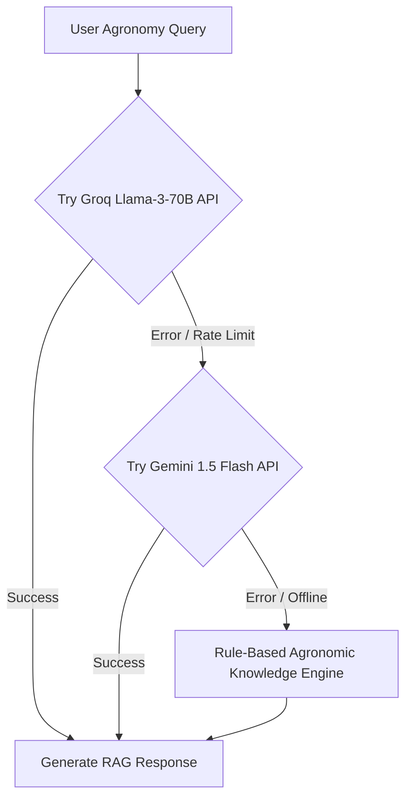

# 🤖 JalSathi AI – RAG-Powered Agronomy Voice & Text Assistant

## 📖 Overview
**JalSathi AI (জলसाथी)** is an intelligent agronomic virtual assistant designed specifically for Indian farmers. It combines **Retrieval-Augmented Generation (RAG)** over verified agricultural university guidelines (ICAR / SAU **Package of Practices**) with multi-lingual Speech-to-Text (STT) and Text-to-Speech (TTS) audio engines.

```text
┌─────────────────┐     ┌───────────────────────┐     ┌──────────────────────┐
│  Farmer Voice   │ ──> │ Speech-to-Text        │ ──> │ JalSathi RAG Engine  │
│  / Text Input   │     │ (speech_to_text 7.4)  │     │ (FastAPI Service)    │
└─────────────────┘     └───────────────────────┘     └──────────┬───────────┘
                                                                 │
                                                                 ▼
┌─────────────────┐     ┌───────────────────────┐     ┌──────────────────────┐
│ Audio Speech    │ <── │ Text-to-Speech        │ <── │ ChromaDB Vector Search│
│ Response Output │     │ (flutter_tts 4.2)     │     │ + Groq Llama-3 LLM   │
└─────────────────┘     └───────────────────────┘     └──────────────────────┘
```

---

## 🛠️ Architecture & RAG Pipeline

### 1. Vector Store & Embeddings
- **Knowledge Base**: ICAR Package of Practices (PoP) covering Paddy, Wheat, Potato, Maize, Mustard, Cotton, Tomato, Sugarcane, Chickpea, and Groundnut.
- **Embedding Model**: `sentence-transformers/all-MiniLM-L6-v2` (384 dimensions).
- **Vector DB**: **ChromaDB** persistent vector store (`jaldrishti-backend/app/chroma_db`).
- **Retrieval Mechanism**: Similarity search with Top-K = 3 context chunks injected into the system prompt.

### 2. Multi-Tier LLM Fallback Pipeline
To ensure high availability even under network congestion or API rate limits, JalSathi implements a multi-tier LLM fallback chain:



1. **Primary LLM**: Groq Llama-3-70B (`llama3-70b-8192`) – Sub-second latency.
2. **Secondary LLM**: Google Gemini 1.5 Flash (`gemini-1.5-flash`).
3. **Tertiary Fallback**: Local Rule-Based Agronomic Knowledge Engine (Offline mode).

---

## 🎙️ Speech-to-Text (STT) & Decibel Motion Animation

- **Package**: `speech_to_text: ^7.4.0`
- **Decibel Level Streaming**: Captures real-time voice volume decibels via `onSoundLevelChange: (double level)` callback.
- **Audio Motion Pulse Animation (`_AudioPulsingMicButton`)**: The microphone button dynamically scales up/down in real-time based on the farmer's speech volume intensity, surrounded by an expanding glowing red aura ring.
- **Overflow-Free Active Listening Banner**: Clean `Flexible` text widget displaying active language status without screen truncation (`🎙️ Listening in Bengali... Speak now!`).

---

## 🔊 Text-to-Speech (TTS) Audio Read-Aloud Engine

- **Package**: `flutter_tts: ^4.2.5`
- **Native Audio Playback Button**: Every JalSathi AI bot message bubble includes an interactive **`Listen 🔊`** button.
- **Language Locale Mapping**:
  - 🇧🇩 **Bengali**: `bn-IN`
  - 🇮🇳 **Hindi**: `hi-IN`
  - 🇬🇧 **English**: `en-US`
- **Markdown Synthesizer Sanitization**: Automatically strips Markdown symbols (`*`, `#`, `-`) and normalizes line breaks before speech output for smooth, natural voice narration tuned to farmer speech rates ($0.45\times$).

---

## 🌐 Dynamic Multi-lingual UI Localization

Whenever the farmer changes the language selector dropdown, the screen dynamically updates all UI text:

| Element | English 🇬🇧 | Bengali (বাংলা) 🇧🇩 | Hindi (हिंदी) 🇮🇳 |
|---|---|---|---|
| **Greeting** | `Hello Arpan! 👋` | `নমস্কার Arpan! 👋` | `नमस्ते Arpan! 👋` |
| **Intro Subtitle** | `I am your JalSathi AI companion...` | `আমি আপনার জলসাথী AI সহকারী...` | `मैं आपका जलसाथी AI सहायक हूँ...` |
| **Suggestion Header** | `💡 Quick Suggestion Questions:` | `💡 দ্রুত পরামর্শমূলক প্রশ্নসমূহ:` | `💡 त्वरित सुझाव प्रश्न:` |
| **Sample Question** | `How to control Stem Borer in Paddy?` | `ধানে কান্ড পচা ও মাজরা পোকা দমন করার উপায় কী?` | `धान में तना छेदक (Stem Borer) कीट नियंत्रण कैसे करें?` |

---

## 💻 Code Reference

- **Backend RAG Service**: `app/services/rag_service.py`
- **Vector DB Ingestion**: `app/services/vector_db_service.py`
- **API Endpoint**: `POST /api/v1/jalsathi/chat`
- **Mobile Chat Provider**: `lib/providers/chat_provider.dart`
- **Mobile Screen**: `lib/screens/chat_screen.dart`
- **Chat Bubble Component**: `lib/widgets/chat_bubble.dart`
