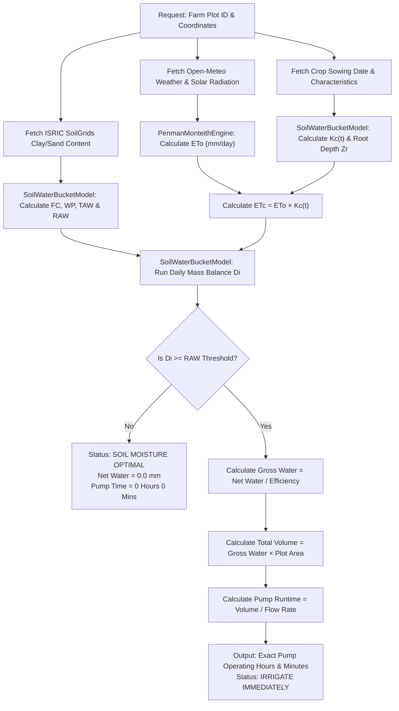

# 📐 FAO-56 Penman-Monteith Hydrological Engine & Soil Water Bucket Model

## 📖 1. Overview & Core Objective

The **JalDrishti Hydrological Engine** implements the scientific principles of **FAO-56 Irrigation and Drainage Paper Guidelines** to provide precision agricultural irrigation advisories. 

Traditional farming relies on fixed calendars or visual soil inspection, leading to severe water wastage, nutrient leaching, or crop drought stress. JalDrishti eliminates guesswork by dynamically modeling daily reference crop evapotranspiration ($ET_0$), actual crop water consumption ($ET_c$), dynamic root zone expansion ($Z_r$), satellite-derived soil moisture retention ($TAW / RAW$), and daily mass-balance water depletion ($D_i$).

```text
┌─────────────────────────┐    ┌─────────────────────────┐    ┌─────────────────────────┐
│  Meteorology & Weather  │ ──>│ FAO-56 Penman-Monteith  │ ──>│ Reference Evapo-        │
│  (Open-Meteo API)       │    │ Equation Engine         │    │ transpiration (ETo)     │
└─────────────────────────┘    └─────────────────────────┘    └────────────┬────────────┘
                                                                            │
┌─────────────────────────┐    ┌─────────────────────────┐                 │
│  ICAR Agronomy Rules    │ ──>│ Dynamic Crop Factor     │ ──> ETc = ETo × Kc(t)
│  (Growth Stages & Kc)   │    │ Kc(t) & Root Depth Zr   │                 │
└─────────────────────────┘    └─────────────────────────┘                 ▼
┌─────────────────────────┐    ┌─────────────────────────┐    ┌─────────────────────────┐
│  Soil Physical Textures │ ──>│ Mass-Balance Soil Water │ ──>│ Net & Gross Water Depth │
│  (ISRIC SoilGrids API)  │    │ Bucket Depletion Model  │    │ ──> Pumping Duration    │
└─────────────────────────┘    └─────────────────────────┘    └─────────────────────────┘
```

---

## 🛰️ 2. Data Sources & Ingestion Matrix

Every variable in JalDrishti's hydrological pipeline is sourced dynamically from authoritative satellite telemetry and scientific datasets:

| Data Parameter | Source / Service | Code Ingestion Location | Description & Unit |
|---|---|---|---|
| **Max / Min Temperature ($T_{\mathrm{max}}, T_{\mathrm{min}}$)** | Open-Meteo Weather API | `app/services/weather_service.py` | 2-meter air temperature [°C] |
| **Relative Humidity ($\mathrm{RH}$)** | Open-Meteo Weather API | `app/services/weather_service.py` | Daily mean relative humidity [%] |
| **Wind Speed ($u_2$)** | Open-Meteo Weather API | `app/services/weather_service.py` | 2-meter wind velocity [m/s] |
| **Solar Radiation ($R_s$)** | Open-Meteo Weather API | `app/services/weather_service.py` | Daily global solar radiation [MJ/m²/day] |
| **Precipitation ($P$)** | Open-Meteo Weather API | `app/services/weather_service.py` | 24-hour satellite rainfall depth [mm] |
| **Clay & Sand Content** | ISRIC SoilGrids 250m API | `app/services/soil_service.py` | Topsoil clay and sand composition [%] |
| **Crop Stage & $K_c$ Curves** | ICAR Package of Practices | `app/engine/crop_coefficients.json` | Stage durations (days) and base $K_c$ values |
| **Field Size & Pump HP** | Farmer Plot Profile | PostgreSQL (`farm_plots` table) | Plot area [Acres] and pump rating [HP, Flow L/s] |

---

## 🧮 3. Step-by-Step Mathematical Equations

### Step 1: Reference Crop Evapotranspiration ($ET_0$)

The **FAO-56 Penman-Monteith equation** represents the rate of evapotranspiration from a standardized grass reference surface ($0.12\mathrm{~m}$ height, surface resistance $70\mathrm{~s/m}$, albedo $0.23$):

$$ET_0 = \frac{0.408 \Delta (R_n - G) + \gamma \frac{900}{T + 273} u_2 (e_s - e_a)}{\Delta + \gamma (1 + 0.34 u_2)} \quad [\mathrm{mm/day}]$$

#### Intermediate Variable Calculations:

1. **Mean Daily Air Temperature ($T_{\mathrm{mean}}$)**:
   $$T_{\mathrm{mean}} = \frac{T_{\mathrm{max}} + T_{\mathrm{min}}}{2} \quad [^\circ\mathrm{C}]$$

2. **Atmospheric Pressure ($P$) & Psychrometric Constant ($\gamma$)**:
   $$P = 101.3 \times \left( \frac{293 - 0.0065 z}{293} \right)^{5.26} \quad [\mathrm{kPa}]$$
   $$\gamma = 0.000665 \times P \quad [\mathrm{kPa}/^\circ\mathrm{C}]$$
   *(where z is elevation above sea level in meters)*

3. **Slope of Saturation Vapour Pressure Curve ($\Delta$)**:
   $$\Delta = \frac{4098 \times \left[ 0.6108 \exp\left( \frac{17.27 T_{\mathrm{mean}}}{T_{\mathrm{mean}} + 237.3} \right) \right]}{(T_{\mathrm{mean}} + 237.3)^2} \quad [\mathrm{kPa}/^\circ\mathrm{C}]$$

4. **Saturation Vapour Pressure ($e_s$) & Actual Vapour Pressure ($e_a$)**:
   $$e^0(T) = 0.6108 \exp\left( \frac{17.27 T}{T + 237.3} \right) \quad [\mathrm{kPa}]$$
   $$e_s = \frac{e^0(T_{\mathrm{max}}) + e^0(T_{\mathrm{min}})}{2} \quad [\mathrm{kPa}]$$
   $$e_a = \left( \frac{\mathrm{RH}}{100} \right) \times e_s \quad [\mathrm{kPa}]$$

5. **Net Solar Radiation ($R_n$)**:
   $$R_{ns} = 0.77 \times R_s \quad (\text{Net shortwave radiation})$$
   $$R_{nl} = 0.10 \times R_s \quad (\text{Net longwave radiation loss approximation})$$
   $$R_n = R_{ns} - R_{nl} \quad [\mathrm{MJ/m}^2/\mathrm{day}]$$

6. **Soil Heat Flux ($G$)**:
   $$G = 0.0 \quad [\mathrm{MJ/m}^2/\mathrm{day}] \quad (\text{Assumed zero for daily time steps})$$

#### Penman-Monteith Variable Glossary:

- **ETo**: Reference crop evapotranspiration rate [mm/day]
- **Rn**: Net surface radiation flux density [MJ/m²/day]
- **G**: Soil heat flux density [MJ/m²/day] (Set to 0.0 for daily calculations)
- **T**: Mean daily air temperature at 2m height [°C]
- **u₂**: Wind speed measured at 2m height [m/s]
- **eₛ**: Saturation vapour pressure of the air [kPa]
- **eₐ**: Actual vapour pressure of the air [kPa]
- **eₛ - eₐ**: Vapour pressure deficit (VPD) [kPa]
- **Δ (Delta)**: Slope of the saturation vapour pressure curve [kPa/°C]
- **γ (Gamma)**: Psychrometric constant [kPa/°C]

---

### Step 2: Dynamic Crop Coefficient ($K_c$) & Crop Transpiration ($ET_c$)

Crop water demand varies significantly across the growing season. The actual crop evapotranspiration ($ET_c$) is determined by adjusting $ET_0$ with a time-dependent Crop Coefficient $K_c(t)$:

$$ET_c = ET_0 \times K_c(t) \quad [\mathrm{mm/day}]$$

#### Dynamic $K_c$ Growth Curve:

```text
  Kc Value
    ▲
Kc_mid ├───────────────────────────────┐
       │                              │ ╲
       │   Stage 2 (Development)      │  ╲ Stage 4 (Late Season)
       │  ╱                           │   ╲
Kc_ini ├─╱   Stage 1 (Initial)        │    ╲
       └─┴────────────────────────────┴────┴───────────► Time (Days)
        0   L_initial               L_mid  L_late
```

1. **Stage 1 (Initial Stage - Sowing/Germination)**:
   $$K_c = K_{c,\mathrm{ini}}$$
   $$Z_r = \max(0.15, Z_{r,\mathrm{max}} \times 0.30) \quad [\mathrm{m}]$$

2. **Stage 2 (Crop Development / Vegetative)**:
   $$\mathrm{Progress} = \frac{\mathrm{Elapsed\ Days} - L_{\mathrm{ini}}}{L_{\mathrm{dev}}}$$
   $$K_c = K_{c,\mathrm{ini}} + \mathrm{Progress} \times (K_{c,\mathrm{mid}} - K_{c,\mathrm{ini}})$$
   $$Z_r = Z_{r,\mathrm{max}} \times (0.30 + 0.70 \times \mathrm{Progress}) \quad [\mathrm{m}]$$

3. **Stage 3 (Mid-Season - Flowering & Yield Formation)**:
   $$K_c = K_{c,\mathrm{mid}}$$
   $$Z_r = Z_{r,\mathrm{max}} \quad [\mathrm{m}]$$

4. **Stage 4 (Late Season - Ripening & Maturity)**:
   $$\mathrm{Progress} = \frac{\mathrm{Elapsed\ Days} - (L_{\mathrm{ini}} + L_{\mathrm{dev}} + L_{\mathrm{mid}})}{L_{\mathrm{late}}}$$
   $$K_c = K_{c,\mathrm{mid}} + \mathrm{Progress} \times (K_{c,\mathrm{end}} - K_{c,\mathrm{mid}})$$
   $$Z_r = Z_{r,\mathrm{max}} \quad [\mathrm{m}]$$

---

### Step 3: ISRIC Soil Physics & Soil Moisture Holding Capacity

Using topsoil Clay percentage ($\mathrm{Clay}$) and Sand percentage ($\mathrm{Sand}$) from satellite soil databases, JalDrishti computes the **Field Capacity** ($\theta_{\mathrm{FC}}$), **Permanent Wilting Point** ($\theta_{\mathrm{WP}}$), **Total Available Water** ($TAW$), and **Readily Available Water** ($RAW$):

1. **Field Capacity ($\theta_{\mathrm{FC}}$)**:
   $$\theta_{\mathrm{FC}} = 0.10 + 0.0025 \times \mathrm{Clay} + 0.0005 \times (100 - \mathrm{Sand}) \quad [\mathrm{m}^3/\mathrm{m}^3]$$

2. **Permanent Wilting Point ($\theta_{\mathrm{WP}}$)**:
   $$\theta_{\mathrm{WP}} = 0.02 + 0.0020 \times \mathrm{Clay} \quad [\mathrm{m}^3/\mathrm{m}^3]$$

3. **Total Available Water ($TAW$)**:
   $$TAW = 1000 \times (\theta_{\mathrm{FC}} - \theta_{\mathrm{WP}}) \times Z_r \quad [\mathrm{mm}]$$

4. **Readily Available Water ($RAW$) Threshold**:
   $$RAW = p \times TAW \quad [\mathrm{mm}]$$
   *(where p is the crop-specific allowable depletion fraction, typically 0.40 - 0.65)*

---

### Step 4: Daily Mass-Balance Soil Water Bucket Model

Daily soil moisture depletion ($D_i$) in the effective root zone ($Z_r$) is tracked via a mass-balance conservation equation:

$$D_i = D_{i-1} + ET_{c,i} - P_{\mathrm{eff},i} - I_i \quad [\mathrm{mm}]$$

Where:
- **$D_i$**: Root zone water depletion at the end of day i [mm]
- **$D_{i-1}$**: Root zone water depletion at the end of previous day i-1 [mm]
- **$ET_{c,i}$**: Crop evapotranspiration loss on day i [mm]
- **$P_{\mathrm{eff},i}$**: Effective rainfall entering root zone on day i [mm], calculated as:
  $$P_{\mathrm{eff},i} = \min(P_i \times 0.80, P_i) \quad [\mathrm{mm}]$$
- **$I_i$**: Net irrigation water applied on day i [mm]

#### Decision Boundary Rules:

- **Condition 1 ($D_i < RAW$)**: Soil moisture is within optimal levels (`SOIL MOISTURE OPTIMAL`). No pumping required. Recommended net water = `0.0 mm`.
- **Condition 2 ($D_i \ge RAW$)**: Soil moisture has reached stress thresholds (`IRRIGATE IMMEDIATELY`). Irrigation required. Recommended net water depth = $D_i$ `mm`.

---

### Step 5: Irrigation Efficiency & Pump Operating Hours Engine

When irrigation is triggered, net water depth ($D_i$) is converted into gross depth based on field application efficiency ($\eta$):

$$D_{\mathrm{gross}} = \frac{D_{\mathrm{net}}}{\eta} \quad [\mathrm{mm}]$$

#### System Efficiency Map ($\eta$):

- **Drip Irrigation**: $\eta = 0.90$ (90%)
- **Overhead Sprinkler**: $\eta = 0.75$ (75%)
- **Surface / Flood Irrigation**: $\eta = 0.50$ (50%)

#### Volumetric Flow & Pump Operating Runtime:

1. **Total Volumetric Water Needed ($V_{\mathrm{liters}}$)**:
   $$A_{\mathrm{sqm}} = A_{\mathrm{acres}} \times 4046.86 \quad [\mathrm{m}^2]$$
   $$V_{\mathrm{liters}} = D_{\mathrm{gross}} \times A_{\mathrm{sqm}} \quad [\mathrm{Liters}]$$
   *(Note: 1 mm depth over 1 m² area equals exactly 1 Liter of water)*

2. **Total Pumping Seconds ($T_{\mathrm{seconds}}$)**:
   $$T_{\mathrm{seconds}} = \frac{V_{\mathrm{liters}}}{Q_{\mathrm{pump}}} \quad [\mathrm{Seconds}]$$
   *(where Q<sub>pump</sub> is the volumetric pump flow rate in Liters per second)*

3. **Hours & Minutes Formatting for Farmer**:
   $$\mathrm{Pump\ Hours} = \left\lfloor \frac{T_{\mathrm{seconds}}}{3600} \right\rfloor$$
   $$\mathrm{Pump\ Minutes} = \mathrm{round}\left( \frac{T_{\mathrm{seconds}} \pmod{3600}}{60} \right)$$

---

## 📊 4. End-to-End Execution Flowchart



---

## 💻 5. Python Implementation Reference

All hydrological calculations are implemented in modular Python classes within the backend engine:

- **Penman-Monteith Engine**: `app/engine/penman_monteith.py`
- **Soil Water Bucket Model**: `app/engine/water_bucket_model.py`
- **Crop Coefficient Config**: `app/engine/crop_coefficients.json`
- **API Endpoint Router**: `app/api/v1/endpoints/irrigation.py`
