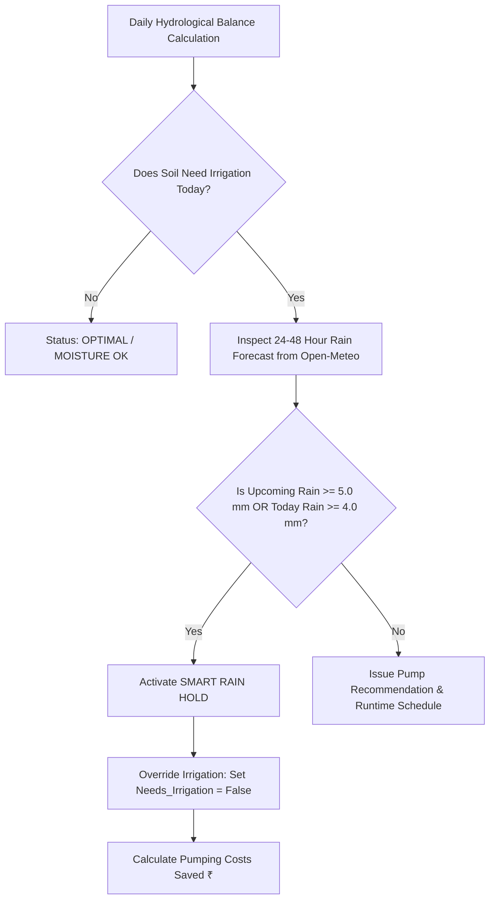

# 🌧️ Smart Rain Hold Advisory & Cumulative ROI Tracker

## 📖 Overview
Unnecessary irrigation right before natural rainfall leads to waterlogging, nutrient leaching, root asphyxiation, and wasteful expenditure on diesel and electricity. The **Smart Rain Hold Engine** in JalDrishti inspects upcoming 24–48 hour satellite precipitation forecasts and suppresses irrigation schedules, quantifying financial and environmental ROI for the farmer.

---

## ⚡ Smart Rain Hold Decision Engine

### Trigger Rules
1. **Upcoming 48-Hour Rainfall**: Sum of precipitation forecasts for Day $+1$ and Day $+2$:
   $$P_{\text{upcoming}} = \sum_{d=t+1}^{t+2} P_d$$
2. **Hold Threshold**: If $P_{\text{upcoming}} \ge 5.0\text{ mm}$ OR $P_{\text{today}} \ge 4.0\text{ mm}$:
   - `rain_hold_active = True`
   - `status_summary = "RAIN_HOLD"`
   - `needs_irrigation_today = False`

---

## 💰 Cumulative Farmer ROI & Savings Calculations

### 1. Money Saved per Skipped Run

$$\text{Hours Saved} = \max\left(\frac{Total\_Pump\_Seconds}{3600}, 1.5 \text{ hrs}\right)$$
$$\text{Cost Saved per Run (₹)} = \text{Hours Saved} \times (C_{\text{electricity}} + C_{\text{diesel/wear}})$$

> Where combined hourly pumping operating cost is estimated at **₹80.0 / hour** (Electricity + Diesel generator backup + Pump maintenance).

### 2. Cumulative Season Metrics (ROI Matrix)

$$\text{Total Water Saved (L)} = (Gross\_Water\_Depth \text{ [mm]} \times Area \text{ [m}^2\text{]}) \times (\text{Skipped Runs} + 3)$$
$$\text{Total Pump Hours Saved} = \frac{\text{Total Water Saved (L)}}{Pump\_Flow\_Rate \text{ [L/s]} \times 3600}$$
$$\text{Total Money Saved (₹)} = \text{Total Pump Hours Saved} \times ₹80/\text{hr} + (\text{Skipped Runs} \times \text{Cost Saved per Run})$$
$$\text{Total } CO_2 \text{ Reduced (kg)} = \text{Total Pump Hours Saved} \times 2.8\text{ kg } CO_2/\text{hr}$$

---

## 🎨 Mobile Dashboard UI Components

- **[`SmartRainHoldCard`](file:///d:/jaldrishti/jaldrishti_mobile/lib/widgets/smart_rain_hold_card.dart)**: High-visibility warning card displaying upcoming rain depth, skipped pumping advice, and single-run money savings.
- **[`FarmerRoiSavingsCard`](file:///d:/jaldrishti/jaldrishti_mobile/lib/widgets/farmer_roi_savings_card.dart)**: 4-grid ROI dashboard displaying cumulative Water (Liters), Hours, Money (₹ INR), and $CO_2$ reduction.

---

## 💻 Code Reference

- **Rain Hold & ROI Logic**: [`app/api/v1/endpoints/irrigation.py`](file:///d:/jaldrishti/jaldrishti-backend/app/api/v1/endpoints/irrigation.py#L195-L245)
- **Response Schema**: [`app/schemas/irrigation_schema.py`](file:///d:/jaldrishti/jaldrishti-backend/app/schemas/irrigation_schema.py)
