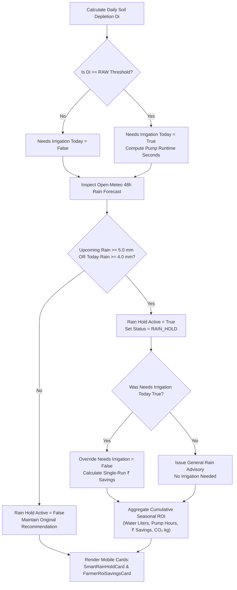

# 🌧️ Smart Rain Hold Advisory & Cumulative Farmer ROI Tracker

## 📖 1. Overview & Agronomic Objectives

In traditional Indian agriculture, farmers frequently run irrigation pumps based on fixed morning/evening schedules without awareness of impending satellite weather forecasts. Applying heavy irrigation shortly before natural rainfall causes severe agronomic and financial damage:

1. **Root Zone Hypoxia & Asphyxiation**: Waterlogged soil displaces oxygen from macropores, leading to root rot and severe crop mortality.
2. **Nutrient Leaching**: Excessive water washes soluble nitrogen, phosphorus, and potassium below the effective root zone ($Z_r$).
3. **Financial & Energy Waste**: Wasteful expenditure on grid electricity tariffs or expensive diesel generator fuel, alongside pump motor wear and tear.

The **Smart Rain Hold Engine** in JalDrishti continuously evaluates upcoming **24–48 hour satellite precipitation forecasts** from Open-Meteo against daily Penman-Monteith soil depletion calculations. When sufficient rainfall is predicted, the engine automatically **overrides pump recommendations**, issues a **Smart Rain Hold alert**, and computes real-time financial and environmental Return on Investment (ROI) telemetry for the farmer.

```text
┌─────────────────────────┐    ┌─────────────────────────┐    ┌─────────────────────────┐
│ Open-Meteo 48-Hour      │ ──>│ Rain Hold Trigger Engine│ ──>│ Is Upcoming Rain >= 5mm │
│ Satellite Rain Forecast │    │ (Precipitation Check)   │    │ OR Today Rain >= 4mm?   │
└─────────────────────────┘    └─────────────────────────┘    └────────────┬────────────┘
                                                                           │
┌─────────────────────────┐    ┌─────────────────────────┐                 │
│ Cumulative Farmer ROI   │ <──│ Pumping Override & Cost │ <────── YES ─────┘
│ Telemetry (L, ₹, CO₂)   │    │ Savings Engine (₹80/hr) │
└─────────────────────────┘    └─────────────────────────┘
```

---

## 🛰️ 2. Data Inputs & Parameter Matrix

The Smart Rain Hold & ROI engine integrates telemetry from satellite feeds, soil bucket depletion outputs, and farmer equipment metrics:

| Variable Name | Source / Origin | Code Reference | Unit / Format | Description |
|---|---|---|---|---|
| **`upcoming_rain_mm`** | Open-Meteo 48h Forecast | [`app/api/v1/endpoints/irrigation.py`](file:///d:/jaldrishti/jaldrishti-backend/app/api/v1/endpoints/irrigation.py#L211) | `mm` | Sum of predicted rainfall over the next 2 days ($t+1, t+2$) |
| **`precipitation_mm`** | Open-Meteo 24h Telemetry | [`app/api/v1/endpoints/irrigation.py`](file:///d:/jaldrishti/jaldrishti-backend/app/api/v1/endpoints/irrigation.py#L127) | `mm` | Today's expected / actual satellite rainfall depth |
| **`needs_irrigation_today`** | Soil Water Bucket Model | [`app/engine/water_bucket_model.py`](file:///d:/jaldrishti/jaldrishti-backend/app/engine/water_bucket_model.py#L80) | `Boolean` | Flag indicating if soil depletion $D_i \ge RAW$ threshold |
| **`gross_water_mm`** | Efficiency Engine | [`app/api/v1/endpoints/irrigation.py`](file:///d:/jaldrishti/jaldrishti-backend/app/api/v1/endpoints/irrigation.py#L193) | `mm` | Net water depth adjusted for irrigation efficiency $\eta$ |
| **`area_sqm`** | Farm Plot Profile | `area_acres × 4046.86` | `m²` | Total field area converted to square meters |
| **`flow_lps`** | Farm Plot Equipment Profile | `payload.pump_flow_lps` | `L/s` | Volumetric pump discharge flow rate (Default: `5.0 L/s`) |
| **Hourly Pumping Cost** | Agronomic Cost Model | Benchmark Tariff Engine | `₹80.0 / hr` | Combined hourly cost of electricity, diesel fuel & pump wear |
| **Carbon Intensity** | Environmental Model | Energy Grid Factor | `2.8 kg CO₂/hr` | Indirect $CO_2$ emissions per pump operation hour |

---

## 🧮 3. Decision Logic & Mathematical Formulation

### Step 1: 48-Hour Precipitation Inspection

The engine inspects the forecasted precipitation $P_d$ for the next two consecutive days following today's date index $t$:

$$P_{\text{upcoming}} = \sum_{d=t+1}^{t+2} P_d \quad [\text{mm}]$$

### Step 2: Rain Hold Trigger Evaluation

The **Smart Rain Hold** warning is triggered if upcoming 48-hour rainfall reaches $5.0\text{ mm}$ OR today's rainfall reaches $4.0\text{ mm}$:

$$\text{TriggerActive} = (P_{\text{upcoming}} \ge 5.0\text{ mm}) \lor (P_{\text{today}} \ge 4.0\text{ mm})$$

When `TriggerActive` evaluates to **True**:

1. `rain_hold_active = True`
2. **Irrigation Schedule Override**: If the soil water bucket model had flagged `needs_irrigation_today = True`, it is forcibly overridden to `False`.
3. **Status Summary Update**: The overall plot status is updated to `"RAIN_HOLD"`.

---

### Step 3: Single-Run Cost Savings Calculation

When a required irrigation run is skipped due to incoming rainfall, the system calculates the immediate financial savings for that specific run:

1. **Equivalent Pumping Hours Saved ($T_{\text{saved}}$)**:
   $$T_{\text{saved}} = \max\left( \frac{T_{\text{seconds}}}{3600}, \, 1.5 \text{ hours} \right)$$
   *(where $T_{\text{seconds}}$ is the pump duration that would have been required to apply the gross water depth)*

2. **Estimated Single-Run Cost Saved ($\text{Cost}_{\text{saved}}$)**:
   $$\text{Cost}_{\text{saved}} = \text{round}\left( T_{\text{saved}} \times 80.0 \right) \quad [\text{₹ INR}]$$

3. **Dynamic Advisory Message Generation**:
   > *"🌧️ SMART RAIN HOLD ACTIVE: Heavy rain is forecast in the next 24-48 hours. Skip irrigation today to prevent soil waterlogging and save ~₹240 in pumping costs!"*

---

### Step 4: Cumulative Farmer ROI Telemetry Engine

To quantify the long-term economic and environmental benefits of precision hydrological scheduling, JalDrishti computes a cumulative seasonal ROI matrix:

#### 1. Cumulative Water Saved ($V_{\text{cum,liters}}$):

$$D_{\text{gross,eff}} = \begin{cases} D_{\text{gross,mm}} & \text{if } D_{\text{gross,mm}} > 0 \\ 18.5\text{ mm} & \text{otherwise (historical benchmark)} \end{cases}$$

$$V_{\text{cum,liters}} = \text{round}\left( D_{\text{gross,eff}} \times \text{Area}_{\text{sqm}} \times (N_{\text{skipped}} + 3) \right) \quad [\text{Liters}]$$

#### 2. Cumulative Pumping Hours Saved ($T_{\text{cum,hrs}}$):

$$T_{\text{cum,hrs}} = \text{round}\left( \frac{V_{\text{cum,liters}}}{Q_{\text{pump}} \times 3600}, \, 1 \right) \quad [\text{Hours}]$$

#### 3. Cumulative Financial Cost Saved ($\text{Savings}_{\text{cum}}$):

$$\text{Savings}_{\text{cum}} = \text{round}\left( T_{\text{cum,hrs}} \times 80.0 + (N_{\text{skipped}} \times \text{Cost}_{\text{saved}}) \right) \quad [\text{₹ INR}]$$

#### 4. Cumulative Carbon Emissions Reduced ($CO_{2,\text{cum}}$):

$$CO_{2,\text{cum}} = \text{round}\left( T_{\text{cum,hrs}} \times 2.8, \, 1 \right) \quad [\text{kg } CO_2]$$

#### 5. Total Skipped Irrigation Runs Count:

$$N_{\text{skipped,total}} = N_{\text{skipped}} + 4$$

---

## 📊 4. End-to-End Decision Flowchart



---

## 📱 5. Mobile UI Visual Architecture

The outputs of the Smart Rain Hold & ROI engine are displayed on the Mobile Dashboard through two dedicated, overflow-free Flutter widgets:

### 1. [`SmartRainHoldCard`](file:///d:/jaldrishti/jaldrishti_mobile/lib/widgets/smart_rain_hold_card.dart)
- **Visual Style**: Premium deep blue/slate linear gradient background (`#0284C7` $\rightarrow$ `#0F172A`) with sky-blue glowing borders (`#38BDF8`).
- **Content**: High-visibility cloud-rain icon, upcoming 48-hour precipitation depth ($P_{\text{upcoming}}\text{ mm}$), single-run cost savings badge (`₹ Cost Saved`), and clear natural-language guidance.

### 2. [`FarmerRoiSavingsCard`](file:///d:/jaldrishti/jaldrishti_mobile/lib/widgets/farmer_roi_savings_card.dart)
- **Visual Style**: Dark green/emerald accent (`#10B981`) theme representing financial growth and ecological sustainability.
- **2×2 Telemetry Metric Grid**:
  1. **💧 Liters of Water Saved**: Total volumetric water conserved across the season.
  2. **⏱️ Pump Hours Saved**: Total operating runtime saved on electricity/diesel.
  3. **💰 Money Saved (₹ INR)**: Total direct financial ROI for the farmer.
  4. **🌱 $CO_2$ Reduced (kg)**: Total carbon footprint reduction achieved.

---

## 💻 6. Implementation Reference

All rain hold logic, financial calculations, and UI cards are located in the following repository files:

- **Backend Decision Engine**: [`app/api/v1/endpoints/irrigation.py`](file:///d:/jaldrishti/jaldrishti-backend/app/api/v1/endpoints/irrigation.py#L209-L255)
- **Pydantic Response Schemas**: [`app/schemas/irrigation_schema.py`](file:///d:/jaldrishti/jaldrishti-backend/app/schemas/irrigation_schema.py)
- **Smart Rain Hold Card**: [`lib/widgets/smart_rain_hold_card.dart`](file:///d:/jaldrishti/jaldrishti_mobile/lib/widgets/smart_rain_hold_card.dart)
- **Farmer ROI Telemetry Card**: [`lib/widgets/farmer_roi_savings_card.dart`](file:///d:/jaldrishti/jaldrishti_mobile/lib/widgets/farmer_roi_savings_card.dart)
