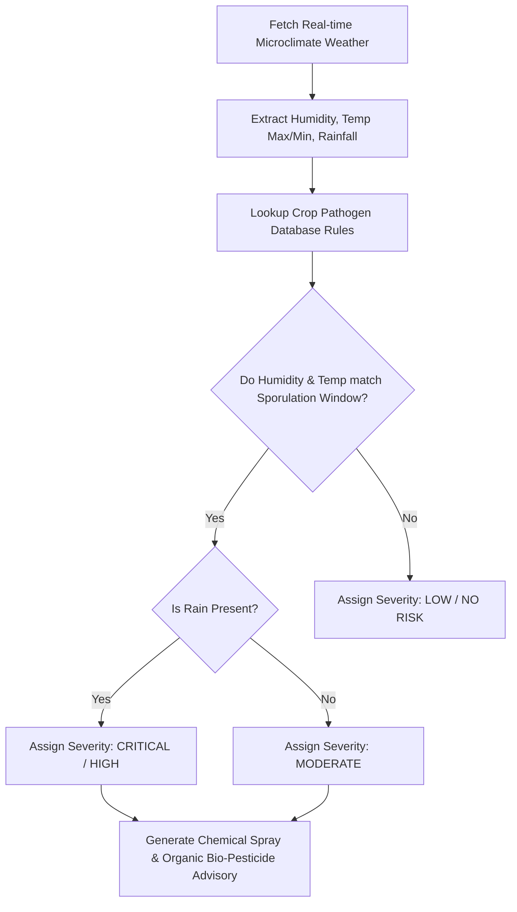

# 🐛 Weather-Based Pest & Disease Early Warning Engine

## 📖 Overview
Fungal, bacterial, and insect crop pests thrive under specific microclimatic thresholds of relative humidity, temperature, and leaf wetness duration. The **Weather-Based Pest Advisory Engine** in JalDrishti cross-references real-time Open-Meteo satellite weather telemetry with agronomic pathogen proliferation rules to deliver preventive disease advisories before visible field infection occurs.

---

## 🦠 Crop Pathogen Rule Matrix

| Crop | Disease / Pest Name | Pathogen Scientific Name | Weather Trigger Thresholds | Severity Risk |
|---|---|---|---|---|
| 🌾 **Paddy** | **Paddy Blast** | *Magnaporthe oryzae* | Humidity $> 85\%$, Temp $20^\circ\text{C} - 28^\circ\text{C}$, Rain $> 1\text{ mm}$ | **HIGH / CRITICAL** |
| 🌾 **Paddy** | **Sheath Blight** | *Rhizoctonia solani* | Humidity $> 88\%$, Temp $28^\circ\text{C} - 32^\circ\text{C}$ | **HIGH** |
| 🥔 **Potato** | **Late Blight** | *Phytophthora infestans* | Humidity $> 90\%$, Temp $12^\circ\text{C} - 22^\circ\text{C}$, Rain $> 2\text{ mm}$ | **CRITICAL** |
| 🌾 **Wheat** | **Yellow (Stripe) Rust** | *Puccinia striiformis* | Humidity $> 80\%$, Temp $10^\circ\text{C} - 18^\circ\text{C}$ | **HIGH** |
| 🌻 **Mustard** | **Mustard Aphids** | *Lipaphis erysimi* | Humidity $60\% - 75\%$, Temp $15^\circ\text{C} - 24^\circ\text{C}$, Rain $= 0\text{ mm}$ | **MODERATE / HIGH** |
| 🌽 **Maize** | **Fall Armyworm** | *Spodoptera frugiperda* | Humidity $> 70\%$, Temp $24^\circ\text{C} - 32^\circ\text{C}$ | **HIGH** |

---

## 🔬 Pest Risk Evaluation Algorithm



---

## 💊 Bio-Chemical Advisory Output Schema

When a threat is identified, the backend generates actionable solutions:

### Example Output for Potato Late Blight:
```json
{
  "pest_name": "Potato Late Blight",
  "pathogen": "Phytophthora infestans",
  "severity": "CRITICAL",
  "risk_score": 92,
  "trigger_reason": "High humidity (93%) and cool temperatures (16°C) present ideal conditions for Late Blight sporangia germination.",
  "symptoms_to_inspect": "Water-soaked dark lesions on leaf tips and white cottony fungal growth on lower leaf surfaces.",
  "chemical_treatment": {
    "fungicide": "Mancozeb 75% WP or Ridomil Gold (Metalaxyl + Mancozeb)",
    "dosage": "2.5 g / Liter of water",
    "spray_interval": "Every 7 days during high humidity"
  },
  "organic_treatment": {
    "solution": "Copper Oxychloride or Trichoderma viride bio-fungicide",
    "dosage": "5.0 g / Liter of water",
    "preventive_notes": "Ensure proper field drainage and avoid overhead sprinkler irrigation."
  }
}
```

---

## 📱 Mobile Screen Implementation

- **[`PestAdvisoryScreen`](file:///d:/jaldrishti/jaldrishti_mobile/lib/screens/pest_advisory_screen.dart)**: Accessible via the App Drawer. Features severity color-coded alert badges (Red = Critical, Amber = High, Green = Low), symptom field inspection checklists, and chemical vs organic spray toggles.

---

## 💻 Code Reference

- **Pest Science Engine**: [`app/engine/pest_disease_engine.py`](file:///d:/jaldrishti/jaldrishti-backend/app/engine/pest_disease_engine.py)
- **API Endpoint**: `POST /api/v1/crops/pest-advisory`
- **Mobile Screen**: [`lib/screens/pest_advisory_screen.dart`](file:///d:/jaldrishti/jaldrishti_mobile/lib/screens/pest_advisory_screen.dart)
