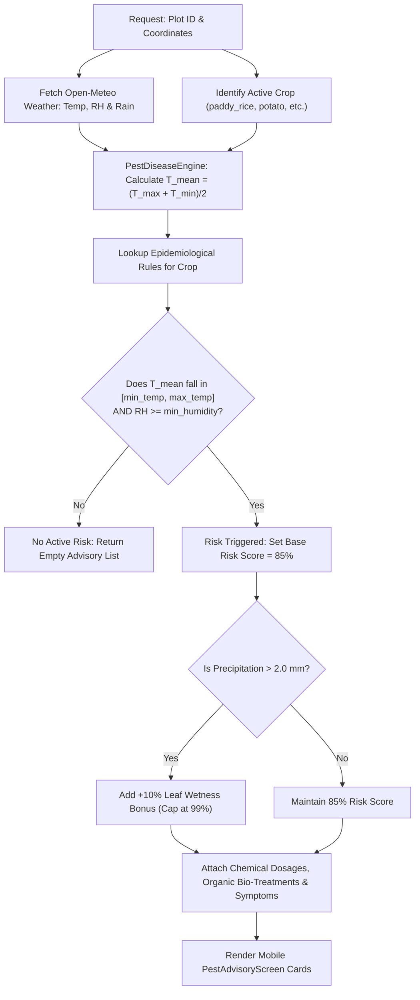

# 🐛 Weather-Based Pest & Disease Early Warning Engine

## 📖 1. Overview & Agronomic Importance

Fungal spores, bacterial blights, and insect larvae proliferate under precise microclimatic windows of ambient temperature, relative humidity ($\text{RH}$), and leaf surface wetness. Traditionally, Indian farmers detect pest infestations only after visual damage appears (such as leaf blast lesions or whorl feeding holes), when crop yield loss is already irreversible.

The **Weather-Based Pest & Disease Early Warning Engine** in JalDrishti continuously evaluates real-time Open-Meteo satellite weather telemetry against agricultural university epidemiology models (ICAR / SAU **Package of Practices**). By predicting microclimate sporulation windows **before pathogen establishment**, JalDrishti provides preventive chemical dosages and organic bio-control solutions, protecting crop yields while reducing unnecessary pesticide expenditure.

```text
┌─────────────────────────┐    ┌─────────────────────────┐    ┌─────────────────────────┐
│  Microclimate Weather   │ ──>│ Epidemiological Match   │ ──>│ Calculate Risk Score    │
│  (Temp, Humidity, Rain) │    │ (Temp & RH Thresholds)  │    │ & Severity Rating       │
└─────────────────────────┘    └─────────────────────────┘    └────────────┬────────────┘
                                                                           │
┌─────────────────────────┐    ┌─────────────────────────┐                 │
│ Actionable Pest Card    │ <──│ Chemical & Organic Bio- │ <─────────────────┘
│ (PestAdvisoryScreen)    │    │ Treatment Advisories    │
└─────────────────────────┘    └─────────────────────────┘
```

---

## 🛰️ 2. Microclimate Input Parameters

The epidemiological risk engine evaluates daily meteorological telemetry against crop-specific pathogen models:

| Variable Name | Source / Provider | Code Location | Unit / Format | Agronomic Function |
|---|---|---|---|---|
| **`max_temp_c`** | Open-Meteo Satellite Feed | `app/services/weather_service.py` | $^\circ\text{C}$ | Daily maximum air temperature |
| **`min_temp_c`** | Open-Meteo Satellite Feed | `app/services/weather_service.py` | $^\circ\text{C}$ | Daily minimum air temperature |
| **`temp_mean`** | Engine Calculation | `(max_temp + min_temp) / 2` | $^\circ\text{C}$ | Mean daily thermal window for spore germination |
| **`humidity_percent`** | Open-Meteo Satellite Feed | `app/services/weather_service.py` | $\%$ | Relative humidity (RH) at 2m height |
| **`precipitation_mm`** | Open-Meteo Satellite Feed | `app/services/weather_service.py` | $\text{mm}$ | Rainfall depth (amplifies fungal leaf wetness) |
| **`crop_id`** | Farm Plot Profile | PostgreSQL (`farm_plots`) | `String` | Target crop identifier (`paddy_rice`, `potato`, etc.) |

---

## 🔬 3. Agronomic Pathogen Rule Matrix

JalDrishti embeds verified epidemiological rules for major Indian cash and food crops within `app/engine/pest_disease_engine.py`:

| Target Crop | Pathogen / Disease Name | Category | Temp Window | Min RH | Severity | Symptoms & Diagnostics |
|---|---|---|---|---|---|---|
| 🌾 **Paddy** | **Rice Blast** (*Pyricularia oryzae*) | Fungal Disease | $18^\circ\text{C} - 28^\circ\text{C}$ | $\ge 80\%$ | **HIGH** | Spindle-shaped brown leaf lesions with grayish centers. |
| 🌾 **Paddy** | **Sheath Blight** (*Rhizoctonia solani*) | Fungal Disease | $28^\circ\text{C} - 35^\circ\text{C}$ | $\ge 85\%$ | **CRITICAL** | Oval greenish-gray lesions on leaf sheaths near water line. |
| 🌾 **Paddy** | **Yellow Stem Borer** (*Scirpophaga incertulas*) | Insect Pest | $25^\circ\text{C} - 36^\circ\text{C}$ | $\ge 60\%$ | **MEDIUM** | Dead hearts in vegetative stage; empty white panicles in bloom. |
| 🥔 **Potato** | **Late Blight** (*Phytophthora infestans*) | Fungal Blight | $10^\circ\text{C} - 22^\circ\text{C}$ | $\ge 85\%$ | **CRITICAL** | Water-soaked dark leaf lesions with white morning dew mildew. |
| 🌾 **Wheat** | **Yellow / Stripe Rust** (*Puccinia striiformis*) | Fungal Rust | $8^\circ\text{C} - 20^\circ\text{C}$ | $\ge 75\%$ | **HIGH** | Bright yellow pustules arranged in linear stripes along leaf veins. |
| 🌻 **Mustard** | **Mustard Aphid** (*Lipaphis erysimi*) | Sucking Pest | $15^\circ\text{C} - 26^\circ\text{C}$ | $\ge 55\%$ | **HIGH** | Green/black sap-sucking clusters on inflorescence & leaf curls. |
| 🌽 **Maize** | **Fall Armyworm** (*Spodoptera frugiperda*) | Lepidopteran Pest | $22^\circ\text{C} - 34^\circ\text{C}$ | $\ge 65\%$ | **CRITICAL** | Ragged whorl feeding holes & heavy frass in central funnels. |

---

## 🧮 4. Epidemiological Risk Evaluation & Scoring Algorithm

The evaluation algorithm executes daily for every active crop plot:

### Step 1: Thermal Mean Calculation
$$T_{\text{mean}} = \frac{T_{\text{max}} + T_{\text{min}}}{2} \quad [^\circ\text{C}]$$

### Step 2: Microclimate Matching Rules

For each pathogen rule $r$ associated with the active crop:

1. **Temperature Match ($M_T$)**:
   $$M_T = (T_{\text{min}} \le T_{\text{mean}} \le T_{\text{max}})$$

2. **Humidity Match ($M_{\text{RH}}$)**:
   $$M_{\text{RH}} = (\text{RH} \ge \text{RH}_{\text{min}})$$

### Step 3: Dynamic Risk Scoring & Leaf Wetness Amplification

When both $M_T$ and $M_{\text{RH}}$ evaluate to **True**:

$$S_{\text{base}} = 85$$

If precipitation $P > 2.0\text{ mm}$ (indicating extended leaf surface wetness):

$$S_{\text{risk}} = \min(S_{\text{base}} + 10, \, 99) \quad [\%]$$

Otherwise:

$$S_{\text{risk}} = 85 \quad [\%]$$

---

## 💊 5. Chemical & Bio-Organic Treatment Recommendations

When a pathogen risk threshold is breached, the engine supplies paired **Chemical** and **Organic Bio-Control** treatment procedures:

### 1. Rice Blast (*Pyricularia oryzae*)
- **Chemical Treatment**: Tricyclazole 75 WP @ $0.6\text{ g/L}$ water ($120\text{ g/acre}$) OR Isoprothiolane 40 EC @ $1.5\text{ mL/L}$.
- **Organic Bio-Treatment**: Spray *Pseudomonas fluorescens* @ $10\text{ g/L}$ OR Neem Oil ($10,000\text{ ppm}$) @ $3\text{ mL/L}$.
- **Preventive Cultural Tip**: Avoid excessive Nitrogen fertilizer applications during overcast, high-humidity weather.

### 2. Potato Late Blight (*Phytophthora infestans*)
- **Chemical Treatment**: Prophylactic: Mancozeb 75 WP @ $2.5\text{ g/L}$. Curative: Cymoxanil 8% + Mancozeb 64% WP @ $3.0\text{ g/L}$.
- **Organic Bio-Treatment**: Copper Oxychloride 50 WP @ $3.0\text{ g/L}$ OR *Trichoderma viride* foliar spray.
- **Preventive Cultural Tip**: Earthing up soil to cover exposed tubers and destroying infected plant haulms.

### 3. Maize Fall Armyworm (*Spodoptera frugiperda*)
- **Chemical Treatment**: Emamectin Benzoate 5% SG @ $0.4\text{ g/L}$ OR Spinetoram 11.7% SC @ $0.5\text{ mL/L}$ directed directly into plant whorls.
- **Organic Bio-Treatment**: Apply *Metarhizium anisopliae* @ $5.0\text{ g/L}$ OR sand + neem cake mixture ($9:1$ ratio) into leaf funnels.
- **Preventive Cultural Tip**: Deep summer plowing to expose pupae to predatory birds.

---

## 📊 6. End-to-End Execution Flowchart



---

## 📱 7. Mobile UI Visual Architecture

The advisory results are rendered on the Flutter mobile app via `PestAdvisoryScreen`:

1. **Severity Risk Badges**:
   - **`CRITICAL`** (Red `#EF4444`): Immediate outbreak warning requiring curative spray within 24 hours.
   - **`HIGH`** (Amber `#F59E0B`): Favorable sporulation microclimate; preventive spray advised.
   - **`MEDIUM`** (Blue `#38BDF8`): Moderate insect/pathogen activity.
2. **Interactive Treatment Selector**:
   - Toggle between **Chemical Spray Dosage** and **Organic Bio-Pesticide** tabs.
3. **Symptom Field Checklist**:
   - Clear diagnostic descriptions assisting farmers in field visual inspection.

---

## 💻 8. Code Implementation Reference

- **Pest & Disease Science Engine**: `app/engine/pest_disease_engine.py`
- **API Endpoint Handler**: `app/api/v1/endpoints/crops.py`
- **Mobile Pest Advisory Screen**: `lib/screens/pest_advisory_screen.dart`
