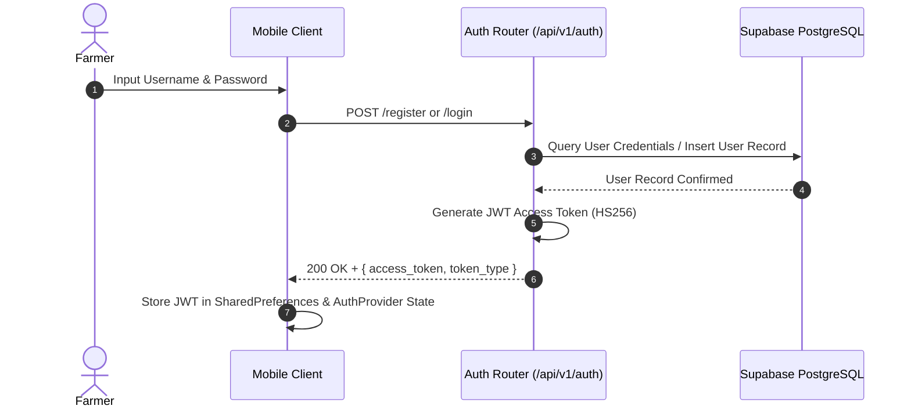
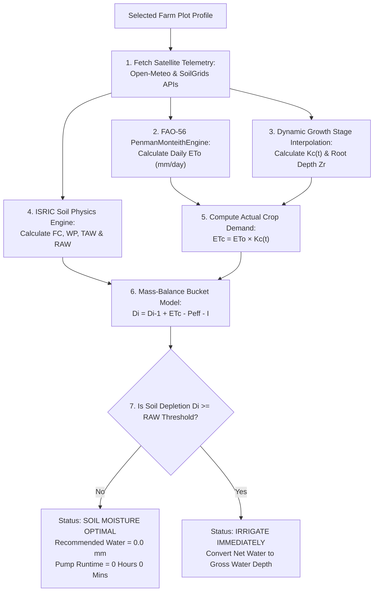
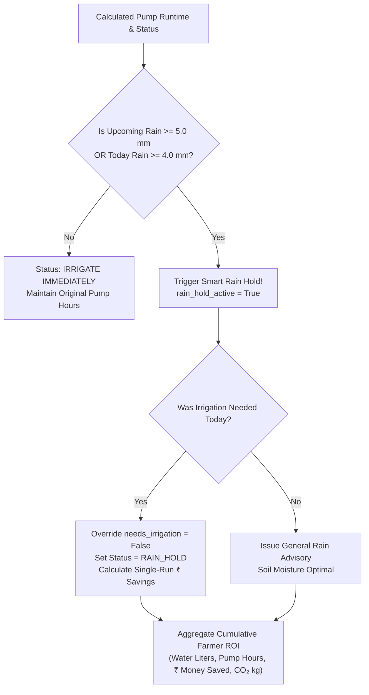
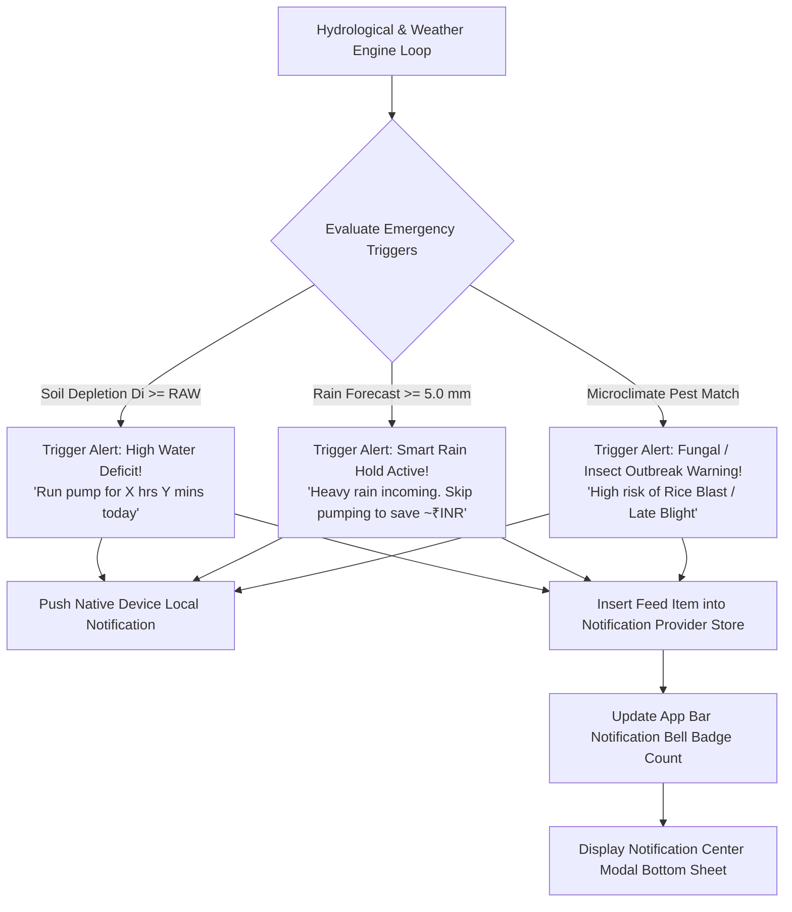

# 🔄 End-to-End Master Irrigation Workflow & Operational Lifecycle

## 📖 1. Executive Summary & Workflow Overview

The **JalDrishti Master Irrigation Workflow** defines the complete operational journey of a farmer within the system—from initial account creation and farm plot onboarding to satellite-driven hydrological modeling, automated pumping schedule generation, Smart Rain Hold advisories, field analytics, and real-time emergency notifications.

By replacing traditional static watering routines with dynamic satellite telemetry, satellite soil physics, and FAO-56 scientific equations, JalDrishti protects crops from water stress and waterlogging while minimizing operational expenditures on electricity and diesel fuel.

```text
┌─────────────────────────────────────────────────────────────────────────────────────────┐
│                                PHASE 1: ONBOARDING & SETUP                              │
│  User Registration (JWT)  ──>  Farmer Profile Setup  ──>  Farm Plot Configuration       │
└───────────────────────────────────────────┬─────────────────────────────────────────────┘
                                            │
                                            ▼
┌─────────────────────────────────────────────────────────────────────────────────────────┐
│                           PHASE 2: HYDROLOGICAL CALCULATIONS                            │
│  Open-Meteo Satellite Feed  ──>  FAO-56 ETo Engine  ──>  Dynamic Kc(t) & ETc Loss       │
│  ISRIC SoilGrids Physics    ──>  Soil TAW / RAW     ──>  Mass-Balance Bucket Depletion Di│
└───────────────────────────────────────────┬─────────────────────────────────────────────┘
                                            │
                                            ▼
┌─────────────────────────────────────────────────────────────────────────────────────────┐
│                       PHASE 3: DECISION & SMART RAIN HOLD ENGINE                        │
│  Di >= RAW Trigger Check    ──>  Inspect 48h Rain    ──>  Pump Hours / Rain Hold        │
└───────────────────────────────────────────┬─────────────────────────────────────────────┘
                                            │
                                            ▼
┌─────────────────────────────────────────────────────────────────────────────────────────┐
│                        PHASE 4: FIELD ANALYTICS & NOTIFICATIONS                         │
│  5-Tab Analytics Suite      ──>  Cumulative ROI      ──>  Push / In-App Alerts          │
└─────────────────────────────────────────────────────────────────────────────────────────┘
```

---

## 👤 2. Phase 1: User Onboarding, Profile & Farm Plot Registration

### 2.1 User Account Registration & Security Authentication
- **Action**: Farmer registers an account via the mobile registration screen or login screen.
- **Backend Endpoint**: `POST /api/v1/auth/register` and `POST /api/v1/auth/login`
- **Mechanism**:
  1. Hashed password generation via **bcrypt** hashing ($12$ rounds).
  2. Issuance of a standard **JWT Access Token** (`HS256` signed) stored securely in mobile `SharedPreferences`.



---

### 2.2 Onboarding Survey & Farmer Profile Setup
- **Action**: Farmer completes the initial onboarding profile setup.
- **Backend Model**: `User_Profile` table in PostgreSQL.
- **Fields Captured**:
  - `first_name`, `last_name`, `phone_number`
  - `state`, `district`, `location_name` (e.g., *"Burdwan, West Bengal"*)
  - `farm_area_acres` (e.g., `2.5` acres)
  - `interested_crop` (e.g., `paddy_rice`, `potato`, `wheat`)
  - `preferred_language` (`English`, `Bengali`, `Hindi`)

---

### 2.3 Farm Plot Configuration & Equipment Attributes
- **Action**: Farmer adds one or more specific farm plots via [`add_edit_farm_plot_screen.dart`](file:///d:/jaldrishti/jaldrishti_mobile/lib/screens/add_edit_farm_plot_screen.dart).
- **Backend Endpoint**: `POST /api/v1/plots/`
- **Fields & Parameters Required for Hydrology**:

| Parameter Field | Type / Unit | Description & Operational Purpose |
|---|---|---|
| **`name`** | `String` | Unique field name (e.g., *"Main Paddy Field"*) |
| **`latitude` & `longitude`** | `Float` | Geolocation coordinates for satellite telemetry fetching |
| **`crop_id`** | `String` | Crop selection (`paddy_rice`, `potato`, `wheat`, `mustard`, `maize`) |
| **`sowing_date`** | `YYYY-MM-DD` | Date of planting to calculate dynamic crop growth stage |
| **`area_acres`** | `Float` | Land size in acres (converted to $\text{m}^2$: $1\text{ acre} = 4046.86\text{ m}^2$) |
| **`pump_hp`** | `Float` | Pump motor power rating (HP) |
| **`pump_flow_lps`** | `Float` | Volumetric pump flow rate ($Q_{\text{pump}}$ in Liters per second) |
| **`irrigation_method`** | `String` | System efficiency profile: `drip` ($90\%$), `sprinkler` ($75\%$), `flood` ($50\%$) |
| **`soil_type`** | `String` | Topsoil texture: `clay_loam`, `sandy_loam`, `loam`, `silty_clay`, `heavy_clay` |

---

## 🧮 3. Phase 2: Hydrological Science & Meteorological Calculation Pipeline

When the farmer opens the app or switches active farm plots, JalDrishti automatically executes the 7-step FAO-56 hydrological calculation pipeline:



---

### Step 2.1: Automated Telemetry Ingestion
1. **Weather Telemetry**: Sourced from Open-Meteo API (cached in Redis Cloud `weather:{lat}:{lon}` for 3 hours).
   - Variables fetched: Maximum Temperature ($T_{\text{max}}$), Minimum Temperature ($T_{\text{min}}$), Relative Humidity ($\text{RH}$), Solar Radiation ($R_s$), Wind Speed at 2m height ($u_2$), Precipitation ($P$).
2. **Soil Physics Telemetry**: Sourced from ISRIC SoilGrids 250m API (cached in Redis Cloud `soil:{lat}:{lon}` for 7 days).
   - Variables fetched: Topsoil Clay $\%$ and Sand $\%$.
3. **Crop Stage Telemetry**: Sourced from ICAR Package of Practices (`crop_coefficients.json`).
   - Variables fetched: Stage durations ($L_{\text{ini}}, L_{\text{dev}}, L_{\text{mid}}, L_{\text{late}}$), stage $K_c$ values ($K_{c,\text{ini}}, K_{c,\text{mid}}, K_{c,\text{end}}$), and maximum root depth ($Z_{r,\text{max}}$).

---

### Step 2.2: FAO-56 Penman-Monteith Reference Evapotranspiration ($ET_0$)

The backend [`PenmanMonteithEngine`](file:///d:/jaldrishti/jaldrishti-backend/app/engine/penman_monteith.py) calculates daily reference crop evapotranspiration ($ET_0$) for a standard grass reference surface:

$$ET_0 = \frac{0.408 \Delta (R_n - G) + \gamma \frac{900}{T + 273} u_2 (e_s - e_a)}{\Delta + \gamma (1 + 0.34 u_2)}$$

#### Mathematical Components:
1. **Mean Temperature**: $T_{\text{mean}} = \frac{T_{\text{max}} + T_{\text{min}}}{2} \quad [^\circ\text{C}]$
2. **Atmospheric Pressure**: $P = 101.3 \times \left(\frac{293 - 0.0065 z}{293}\right)^{5.26} \quad [\text{kPa}]$
3. **Psychrometric Constant**: $\gamma = 0.000665 \times P \quad [\text{kPa/}^\circ\text{C}]$
4. **Saturation Vapour Pressure Curve Slope**: $\Delta = \frac{4098 \times e^0(T_{\text{mean}})}{(T_{\text{mean}} + 237.3)^2} \quad [\text{kPa/}^\circ\text{C}]$
5. **Vapour Pressure Deficit**: $e_s - e_a = \frac{e^0(T_{\text{max}}) + e^0(T_{\text{min}})}{2} \times \left(1 - \frac{\text{RH}}{100}\right) \quad [\text{kPa}]$
6. **Net Radiation**: $R_n = 0.77 R_s - 0.10 R_s = 0.67 R_s \quad [\text{MJ/m}^2/\text{day}]$
7. **Soil Heat Flux**: $G = 0.0 \quad [\text{MJ/m}^2/\text{day}]$

---

### Step 2.3: Dynamic Crop Coefficient ($K_c$) & Crop Transpiration Loss ($ET_c$)

The backend [`SoilWaterBucketModel`](file:///d:/jaldrishti/jaldrishti-backend/app/engine/water_bucket_model.py) computes elapsed growth days from sowing date to interpolate time-dependent $K_c(t)$ and root depth $Z_r(t)$:

```text
  Kc Factor
    ▲
Kc_mid ├───────────────────────────────┐
       │                              │ ╲
       │   Stage 2 (Development)      │  ╲ Stage 4 (Late Season)
       │  ╱                           │   ╲
Kc_ini ├─╱   Stage 1 (Initial)        │    ╲
       └─┴────────────────────────────┴────┴───────────► Time (Days)
        0   L_initial               L_mid  L_late
```

$$\text{Actual Crop Demand } (ET_c) = ET_0 \times K_c(t) \quad [\text{mm/day}]$$

---

### Step 2.4: Soil Moisture Holding Capacity Calculation

Using topsoil clay $\%$ and sand $\%$ from satellite soil telemetry:

1. **Field Capacity ($\theta_{\text{FC}}$)**:
   $$\theta_{\text{FC}} = 0.10 + 0.0025 \times \text{Clay}\% + 0.0005 \times (100 - \text{Sand}\%) \quad [\text{m}^3/\text{m}^3]$$

2. **Permanent Wilting Point ($\theta_{\text{WP}}$)**:
   $$\theta_{\text{WP}} = 0.02 + 0.0020 \times \text{Clay}\% \quad [\text{m}^3/\text{m}^3]$$

3. **Total Available Water ($TAW$)**:
   $$TAW = 1000 \times (\theta_{\text{FC}} - \theta_{\text{WP}}) \times Z_r \quad [\text{mm}]$$

4. **Readily Available Water ($RAW$) Threshold**:
   $$RAW = p \times TAW \quad [\text{mm}]$$
   *(where $p$ is the allowable depletion fraction, default $0.50$)*

---

### Step 2.5: Daily Mass-Balance Soil Water Bucket Model

Daily soil depletion $D_i$ in the root zone is calculated conservationally:

$$D_i = D_{i-1} + ET_{c,i} - P_{\text{eff},i} - I_i$$

Where:
- $D_{i-1}$: Previous day's soil depletion [$\text{mm}$]
- $ET_{c,i}$: Today's crop evapotranspiration loss [$\text{mm}$]
- $P_{\text{eff},i}$: Effective rainfall depth entering root zone ($P_{\text{eff}} = \min(P \times 0.80, P)$) [$\text{mm}$]
- $I_i$: Net irrigation water applied today [$\text{mm}$]

---

### Step 2.6: Decision Boundary & Volumetric Pump Runtime Calculation

When soil water depletion breaches the threshold ($D_i \ge RAW$):

1. **Status Trigger**: `needs_irrigation_today = True`, `status = "IRRIGATE IMMEDIATELY"`
2. **Net Water Recommended**: $D_{\text{net}} = D_i \quad [\text{mm}]$
3. **Gross Water Adjusted for Irrigation Efficiency**:
   $$D_{\text{gross}} = \frac{D_{\text{net}}}{\eta_{\text{irrigation}}} \quad [\text{mm}]$$
   *(Drip $= 90\%$, Sprinkler $= 75\%$, Flood $= 50\%$)*
4. **Total Volumetric Water Volume**:
   $$V_{\text{liters}} = D_{\text{gross}} \times \text{Area}_{\text{sqm}} \quad [\text{Liters}]$$
5. **Pump Runtime Duration**:
   $$T_{\text{seconds}} = \frac{V_{\text{liters}}}{Q_{\text{pump}} \text{ [L/s]}}$$
   $$\text{Pump Hours} = \left\lfloor \frac{T_{\text{seconds}}}{3600} \right\rfloor, \quad \text{Pump Minutes} = \text{round}\left( \frac{T_{\text{seconds}} \pmod{3600}}{60} \right)$$

---

## 🌧️ 4. Phase 3: Smart Rain Hold Advisory & Cumulative ROI Telemetry

Before issuing the final pump recommendation to the farmer, JalDrishti inspects the **upcoming 48-hour satellite rainfall forecast** ($P_{\text{upcoming}}$):

$$P_{\text{upcoming}} = \sum_{d=t+1}^{t+2} P_d \quad [\text{mm}]$$



### Single-Run & Cumulative ROI Equations:
1. **Single-Run Cost Saved**:
   $$\text{Cost}_{\text{run}} = \text{round}\left( T_{\text{saved}} \times 80.0 \right) \quad [\text{₹ INR}]$$
   *(Benchmark operating tariff: ₹$80.0$ / hour for electricity & diesel generator fuel)*

2. **Cumulative Water Saved ($V_{\text{cum}}$)**:
   $$V_{\text{cum}} = \text{round}\left( D_{\text{gross,eff}} \times \text{Area}_{\text{sqm}} \times (N_{\text{skipped}} + 3) \right) \quad [\text{Liters}]$$

3. **Cumulative Financial Savings ($S_{\text{cum}}$)**:
   $$S_{\text{cum}} = \text{round}\left( T_{\text{cum}} \times 80.0 + (N_{\text{skipped}} \times \text{Cost}_{\text{run}}) \right) \quad [\text{₹ INR}]$$

4. **Cumulative Carbon Footprint Reduced ($E_{\text{CO2}}$)**:
   $$E_{\text{CO2}} = \text{round}\left( T_{\text{cum}} \times 2.8, \, 1 \right) \quad [\text{kg CO}_2]$$

---

## 📊 5. Phase 4: Field Analytics & Visualization Dashboard Engine

The mobile client [`AnalyticsScreen`](file:///d:/jaldrishti/jaldrishti_mobile/lib/screens/analytics_screen.dart) provides a modular 5-tab breakdown of field performance:

```text
┌─────────────────────────────────────────────────────────────────────────────────────────┐
│                                FIELD ANALYTICS SUITE                                    │
│  [🌦️ Weather Stats] [📊 Daily Trend] [💡 Smart Insights] [🌊 Water Balance] [📋 History]│
└─────────────────────────────────────────────────────────────────────────────────────────┘
```

1. **Tab 0: Weather Stats ([`weather_stats_tab.dart`](file:///d:/jaldrishti/jaldrishti_mobile/lib/screens/analytics/weather_stats_tab.dart))**:
   - Maps 6-day weather forecast directly from `daily_breakdown`.
   - Displays Max/Min temperatures, relative humidity $\%$, wind speed (km/h), precipitation depth (mm), and $ET_0$ reference evapotranspiration.
2. **Tab 1: Daily Trends ([`daily_trends_tab.dart`](file:///d:/jaldrishti/jaldrishti_mobile/lib/screens/analytics/daily_trends_tab.dart))**:
   - CustomPainter bar & line chart featuring Y-axis scale labels (`0 mm`, `5 mm`, `10 mm`, `15 mm`).
   - Applied Water bars (Dark Blue), Rainfall bars (Sky Blue), and Crop Demand $ET_c$ golden spline curve.
   - Interactive daily breakdown card list showing exact daily numeric metrics.
3. **Tab 2: Smart Insights ([`smart_insights_tab.dart`](file:///d:/jaldrishti/jaldrishti_mobile/lib/screens/analytics/smart_insights_tab.dart))**:
   - Real-time Hydration Status badge (Optimal / Deficit / High Storage).
   - Precision Savings Counter displaying dynamic water volume saved (kL) and financial savings (₹ INR).
   - Crop growth stage advisory tips and Smart Rain Hold alert banners.
4. **Tab 3: Water Balance ([`water_balance_tab.dart`](file:///d:/jaldrishti/jaldrishti_mobile/lib/screens/analytics/water_balance_tab.dart))**:
   - Dynamic Water Satisfaction Index ($WSI = \frac{\text{Applied} + \text{Rain}}{\text{ETc}} \times 100\%$).
   - Volumetric breakdown cards comparing Irrigation Applied (kL), Rainfall Received (kL), and Crop Demand $ET_c$ (kL).
5. **Tab 4: History Logs ([`history_logs_tab.dart`](file:///d:/jaldrishti/jaldrishti_mobile/lib/screens/analytics/history_logs_tab.dart))**:
   - Queries backend `GET /api/v1/irrigation/history/{plot_id}` endpoint.
   - Renders historical water sessions with dates, notes, mm depth, and equivalent kL volume.
   - Includes a quick **"+ Log Water Run"** modal button so farmers can log irrigation runs directly from Analytics.

---

## 🔔 6. Phase 5: Notification Center & Emergency Advisory System

JalDrishti features a dual-layer notification architecture driven by [`NotificationProvider`](file:///d:/jaldrishti/jaldrishti_mobile/lib/providers/notification_provider.dart) and [`NotificationService`](file:///d:/jaldrishti/jaldrishti_mobile/lib/core/services/notification_service.dart):



### Emergency Alert Categories:
1. **Critical Water Deficit Alert**: Triggered when root zone depletion $D_i \ge RAW$. Notifies the farmer with exact pump operating duration required.
2. **Smart Rain Hold Emergency Alert**: Triggered when heavy rainfall ($P \ge 5.0\text{ mm}$) is forecast. Advises skipping pump runs to prevent crop asphyxiation and save pumping costs.
3. **Pest & Disease Microclimate Outbreak Warning**: Triggered when temperature and relative humidity match crop-specific epidemiological sporulation rules (e.g., Rice Blast, Potato Late Blight, Fall Armyworm).

---

## 💻 7. Master Repository Code Index

| Functional Phase | Backend Python Code | Mobile Flutter Code |
|---|---|---|
| **Phase 1: User & Plot Setup** | [`app/api/v1/endpoints/auth.py`](file:///d:/jaldrishti/jaldrishti-backend/app/api/v1/endpoints/auth.py)<br/>[`app/api/v1/endpoints/farm_plots.py`](file:///d:/jaldrishti/jaldrishti-backend/app/api/v1/endpoints/farm_plots.py) | [`lib/screens/login_screen.dart`](file:///d:/jaldrishti/jaldrishti_mobile/lib/screens/login_screen.dart)<br/>[`lib/screens/add_edit_farm_plot_screen.dart`](file:///d:/jaldrishti/jaldrishti_mobile/lib/screens/add_edit_farm_plot_screen.dart) |
| **Phase 2: Hydrological Engine** | [`app/engine/penman_monteith.py`](file:///d:/jaldrishti/jaldrishti-backend/app/engine/penman_monteith.py)<br/>[`app/engine/water_bucket_model.py`](file:///d:/jaldrishti/jaldrishti-backend/app/engine/water_bucket_model.py) | [`lib/providers/irrigation_provider.dart`](file:///d:/jaldrishti/jaldrishti_mobile/lib/providers/irrigation_provider.dart)<br/>[`lib/widgets/dashboard_pump_card.dart`](file:///d:/jaldrishti/jaldrishti_mobile/lib/widgets/dashboard_pump_card.dart) |
| **Phase 3: Rain Hold & ROI** | [`app/api/v1/endpoints/irrigation.py`](file:///d:/jaldrishti/jaldrishti-backend/app/api/v1/endpoints/irrigation.py#L209-L255) | [`lib/widgets/smart_rain_hold_card.dart`](file:///d:/jaldrishti/jaldrishti_mobile/lib/widgets/smart_rain_hold_card.dart)<br/>[`lib/widgets/farmer_roi_savings_card.dart`](file:///d:/jaldrishti/jaldrishti_mobile/lib/widgets/farmer_roi_savings_card.dart) |
| **Phase 4: Field Analytics** | [`app/api/v1/endpoints/irrigation.py`](file:///d:/jaldrishti/jaldrishti-backend/app/api/v1/endpoints/irrigation.py#L285-L305) | [`lib/screens/analytics_screen.dart`](file:///d:/jaldrishti/jaldrishti_mobile/lib/screens/analytics_screen.dart)<br/>[`lib/screens/analytics/`](file:///d:/jaldrishti/jaldrishti_mobile/lib/screens/analytics/) |
| **Phase 5: Emergency Alerts** | [`app/engine/pest_disease_engine.py`](file:///d:/jaldrishti/jaldrishti-backend/app/engine/pest_disease_engine.py) | [`lib/providers/notification_provider.dart`](file:///d:/jaldrishti/jaldrishti_mobile/lib/providers/notification_provider.dart)<br/>[`lib/core/services/notification_service.dart`](file:///d:/jaldrishti/jaldrishti_mobile/lib/core/services/notification_service.dart) |
