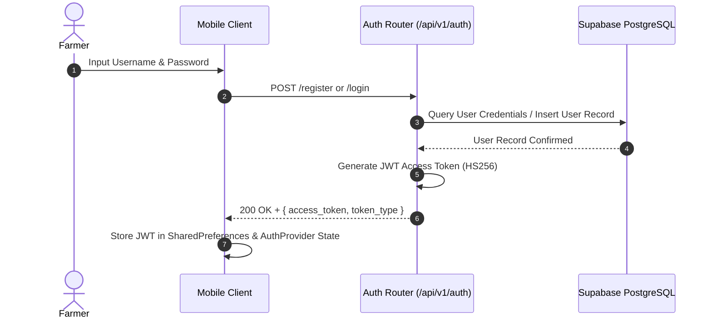
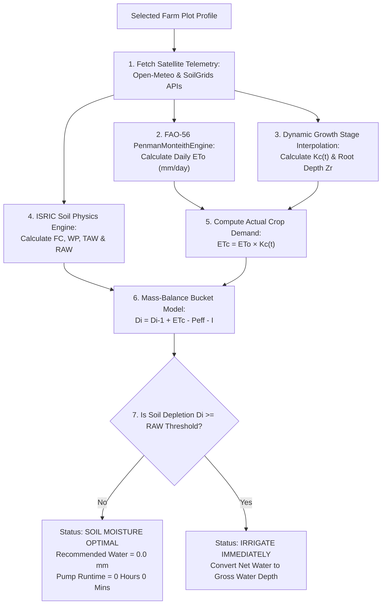
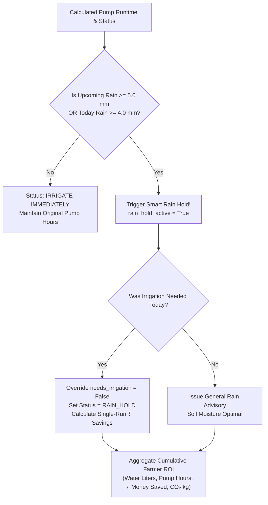
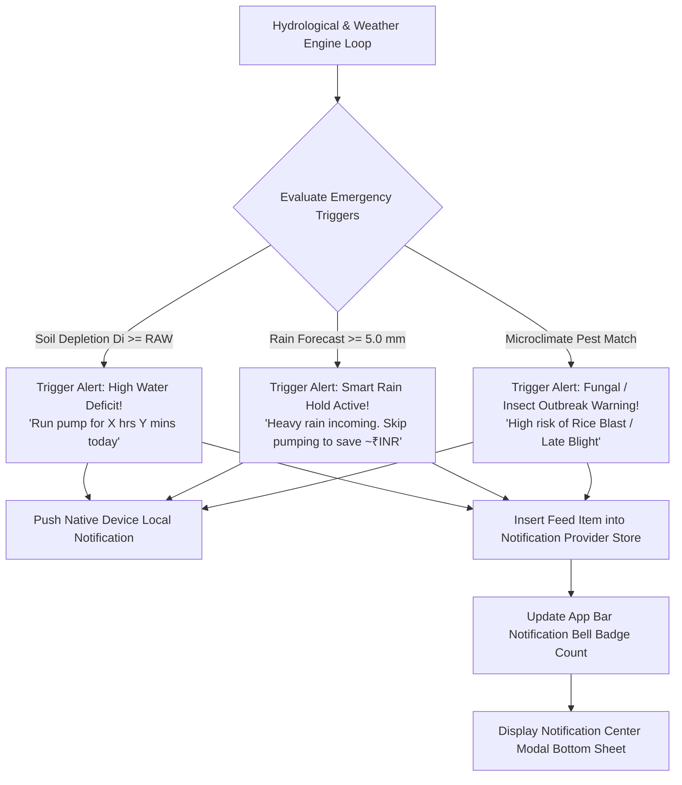

# 🔄 End-to-End Master Irrigation Workflow & Operational Lifecycle

## 📖 1. Executive Summary & Workflow Overview

The **JalDrishti Master Irrigation Workflow** defines the complete operational lifecycle of a farmer within the system—from initial account creation and farm plot onboarding to satellite-driven hydrological modeling, automated pumping schedule generation, Smart Rain Hold advisories, field analytics, and real-time emergency notifications.

By replacing traditional static watering routines with dynamic satellite telemetry, satellite soil physics, and FAO-56 scientific equations, JalDrishti protects crops from water stress and waterlogging while minimizing operational expenditures on electricity and diesel fuel.

```text
┌───────────────────────────────────────────────────────────────────────────────────────────┐
│                                 PHASE 1: ONBOARDING & SETUP                               │
│   User Registration (JWT)  ──>  Farmer Profile Setup  ──>  Farm Plot Configuration        │
└────────────────────────────────────────────┬──────────────────────────────────────────────┘
                                             │
                                             ▼
┌───────────────────────────────────────────────────────────────────────────────────────────┐
│                           PHASE 2: HYDROLOGICAL CALCULATIONS                              │
│   Open-Meteo Satellite Feed  ──>  FAO-56 ETo Engine  ──>  Dynamic Kc(t) & ETc Loss        │
│   ISRIC SoilGrids Physics    ──>  Soil TAW / RAW     ──>  Mass-Balance Bucket Depletion Di │
└────────────────────────────────────────────┬──────────────────────────────────────────────┘
                                             │
                                             ▼
┌───────────────────────────────────────────────────────────────────────────────────────────┐
│                       PHASE 3: DECISION & SMART RAIN HOLD ENGINE                          │
│   Di >= RAW Trigger Check    ──>  Inspect 48h Rain    ──>  Pump Hours / Rain Hold         │
└────────────────────────────────────────────┬──────────────────────────────────────────────┘
                                             │
                                             ▼
┌───────────────────────────────────────────────────────────────────────────────────────────┐
│                        PHASE 4: FIELD ANALYTICS & NOTIFICATIONS                           │
│   5-Tab Analytics Suite      ──>  Cumulative ROI      ──>  Push / In-App Alerts           │
└────────────────────────────────────────────┴──────────────────────────────────────────────┘
```

---

## 👤 2. Phase 1: User Onboarding, Profile & Farm Plot Registration

### 2.1 User Account Registration & Security Authentication
* **Operational Action**: The farmer registers an account via the mobile client.
* **Backend Router**: `app/api/v1/endpoints/auth.py` (`POST /api/v1/auth/register` & `POST /api/v1/auth/login`)
* **Conceptual Requirement & Problem Solved**:
  Traditional farm management systems use unencrypted local storage or simple plain-text passwords, creating severe security vulnerabilities. JalDrishti enforces enterprise-grade security:
  1. Hashed password generation via **bcrypt** hashing ($12$ work factor rounds).
  2. Issuance of a standard **JWT Access Token** (`HS256` signed) stored in mobile `SharedPreferences` and attached to the `Authorization: Bearer <token>` header of every API request.



---

### 2.2 Onboarding Survey & Farmer Profile Setup
* **Operational Action**: The farmer completes the initial profile survey upon first login.
* **Backend Database Table**: `user_profiles` table in Supabase PostgreSQL.
* **Conceptual Requirement**:
  Agronomic parameters vary greatly across geographic regions and farmer preference. Capturing regional location details and native language preferences enables JalDrishti to localize weather forecasts, market advisories, and JalSathi AI voice responses.
* **Captured Fields**:
  - `first_name`, `last_name`, `phone_number`
  - `state`, `district`, `location_name` (e.g., *"Burdwan, West Bengal"*)
  - `farm_area_acres` (e.g., `2.5` acres)
  - `interested_crop` (e.g., `paddy_rice`, `potato`, `wheat`)
  - `preferred_language` (`English`, `Bengali`, `Hindi`)

---

### 2.3 Farm Plot Configuration & Equipment Attributes
* **Operational Action**: The farmer adds one or more specific farm plots via `add_edit_farm_plot_screen.dart`.
* **Backend Router**: `app/api/v1/endpoints/farm_plots.py` (`POST /api/v1/plots/`)
* **Conceptual Requirement**:
  Hydrological modeling requires precise physical boundaries and equipment metrics. Latitude and longitude are required to fetch pinpoint satellite weather and soil telemetry, while pump flow rates ($Q_{\mathrm{pump}}$) and irrigation efficiency ($\eta$) are essential to convert required net water depth ($D_{\mathrm{net}}$) into exact pump runtimes in Hours and Minutes.

| Parameter Field | Type / Unit | Conceptual Requirement & Operational Purpose |
|---|---|---|
| **`name`** | `String` | Unique plot identifier (e.g., *"North Paddy Field"*) |
| **`latitude` & `longitude`** | `Float` | Precise coordinates for fetching Open-Meteo & ISRIC satellite data |
| **`crop_id`** | `String` | Selects ICAR crop coefficient growth curves (`paddy_rice`, `potato`, `wheat`, etc.) |
| **`sowing_date`** | `YYYY-MM-DD` | Used to calculate elapsed growth days and interpolate dynamic $K_c(t)$ and root depth $Z_r(t)$ |
| **`area_acres`** | `Float` | Field size converted to square meters ($1\text{ acre} = 4046.86\text{ m}^2$) for volumetric calculations |
| **`pump_hp`** | `Float` | Pump motor power rating (HP) |
| **`pump_flow_lps`** | `Float` | Volumetric discharge flow rate ($Q_{\mathrm{pump}}$ in Liters/sec) to calculate runtime seconds |
| **`irrigation_method`** | `String` | System application efficiency ($\eta$): `drip` ($0.90$), `sprinkler` ($0.75$), `flood` ($0.50$) |
| **`soil_type`** | `String` | Soil texture profile (`clay_loam`, `sandy_loam`, `loam`, `silty_clay`, `heavy_clay`) |

---

## 🧮 3. Phase 2: Hydrological Science & Meteorological Calculation Pipeline

When the farmer views a farm plot, JalDrishti automatically executes a 7-step FAO-56 hydrological calculation pipeline:



---

### Step 2.1: Automated Satellite Telemetry Ingestion
* **Conceptual Requirement**:
  Traditional precision agriculture requires purchasing expensive physical IoT sensors. JalDrishti replaces hardware sensors by ingesting live satellite data feeds for any field location worldwide:
  1. **Weather Telemetry**: Sourced from Open-Meteo Weather API (cached in Redis Cloud `weather:{lat}:{lon}` for 3 hours). Fetches $T_{\mathrm{max}}, T_{\mathrm{min}}, \mathrm{RH}, R_s, u_2, P$.
  2. **Soil Physics Telemetry**: Sourced from ISRIC SoilGrids 250m API (cached in Redis Cloud `soil:{lat}:{lon}` for 7 days). Fetches topsoil Clay % and Sand %.
  3. **Crop Stage Telemetry**: Sourced from ICAR Package of Practices (`crop_coefficients.json`). Fetches stage durations ($L_{\mathrm{ini}}, L_{\mathrm{dev}}, L_{\mathrm{mid}}, L_{\mathrm{late}}$), stage $K_c$ values, and max root depth $Z_{r,\mathrm{max}}$.

---

### Step 2.2: FAO-56 Penman-Monteith Reference Evapotranspiration ($ET_0$)
* **Conceptual Requirement**:
  To calculate how much water leaves the soil, we must first determine the **pure atmospheric evaporative demand**. $ET_0$ represents the evapotranspiration rate of a standardized grass reference surface under ambient solar radiation, temperature, humidity, and wind conditions. $ET_0$ is intentionally isolated from soil properties.

* **Mathematical Formula**:
  $$ET_0 = \frac{0.408 \Delta (R_n - G) + \gamma \frac{900}{T + 273} u_2 (e_s - e_a)}{\Delta + \gamma (1 + 0.34 u_2)} \quad [\mathrm{mm/day}]$$

* **Intermediate Components**:
  1. **Mean Temperature**: $T_{\mathrm{mean}} = \frac{T_{\mathrm{max}} + T_{\mathrm{min}}}{2} \quad [^\circ\mathrm{C}]$
  2. **Atmospheric Pressure**: $P = 101.3 \times \left(\frac{293 - 0.0065 z}{293}\right)^{5.26} \quad [\mathrm{kPa}]$
  3. **Psychrometric Constant**: $\gamma = 0.000665 \times P \quad [\mathrm{kPa}/^\circ\mathrm{C}]$
  4. **Saturation Vapour Pressure Slope**: $\Delta = \frac{4098 \times e^0(T_{\mathrm{mean}})}{(T_{\mathrm{mean}} + 237.3)^2} \quad [\mathrm{kPa}/^\circ\mathrm{C}]$
  5. **Vapour Pressure Deficit**: $e_s - e_a = \frac{e^0(T_{\mathrm{max}}) + e^0(T_{\mathrm{min}})}{2} \times \left(1 - \frac{\mathrm{RH}}{100}\right) \quad [\mathrm{kPa}]$
  6. **Net Radiation**: $R_n = 0.77 R_s - 0.10 R_s = 0.67 R_s \quad [\mathrm{MJ/m}^2/\mathrm{day}]$
  7. **Soil Heat Flux**: $G = 0.0 \quad [\mathrm{MJ/m}^2/\mathrm{day}]$

* **Backend Class**: `app/engine/penman_monteith.py` (`PenmanMonteithEngine.calculate_daily_eto()`)

---

### Step 2.3: Dynamic Crop Coefficient ($K_c$) & Crop Transpiration Loss ($ET_c$)
* **Conceptual Requirement**:
  Reference evapotranspiration ($ET_0$) reflects grass, not specific crops like paddy or potato. A young seedling consumes far less water than a fully flowering crop. Multiplying $ET_0$ by a time-dependent Crop Coefficient $K_c(t)$ adjusts atmospheric demand to the actual daily crop consumption ($ET_c$).

```text
  Kc Factor
    ▲
Kc_mid ├───────────────────────────────┐
       │                              │ ╲
       │   Stage 2 (Development)      │  ╲ Stage 4 (Late Season)
       │  ╱                           │   ╲
Kc_ini ├─╱   Stage 1 (Initial)        │    ╲
       └─┴────────────────────────────┴────┴───────────► Time (Days)
        0   L_initial               L_mid  L_late
```

* **Calculation Logic**:
  `SoilWaterBucketModel.calculate_dynamic_crop_stage()` calculates `elapsed_days = (today - sowing_date)`. It interpolates dynamic $K_c(t)$ and root depth $Z_r(t)$ across the 4 FAO growth stages:
  - **Stage 1 (Initial)**: $K_c = K_{c,\mathrm{ini}}$, $Z_r = \max(0.15, Z_{r,\mathrm{max}} \times 0.30)$
  - **Stage 2 (Development)**: Linear interpolation between $K_{c,\mathrm{ini}}$ and $K_{c,\mathrm{mid}}$, root expansion $Z_r(t)$
  - **Stage 3 (Mid-Season)**: $K_c = K_{c,\mathrm{mid}}$, full root depth $Z_r = Z_{r,\mathrm{max}}$
  - **Stage 4 (Late Season)**: Linear decline to $K_{c,\mathrm{end}}$, full root depth $Z_r = Z_{r,\mathrm{max}}$

* **Formula**:
  $$\text{Actual Crop Demand } (ET_c) = ET_0 \times K_c(t) \quad [\mathrm{mm/day}]$$

---

### Step 2.4: Soil Moisture Holding Capacity Calculation
* **Conceptual Requirement**:
  Different soils hold different amounts of water. Clay soils hold water tightly, while sandy soils drain rapidly. To know when a crop needs water, we must calculate the **Total Available Water ($TAW$)** and the **Readily Available Water ($RAW$)** stress threshold based on satellite soil texture (Clay % and Sand %).

* **Equations**:
  1. **Field Capacity ($\theta_{\mathrm{FC}}$)** (Volumetric water content at gravity drainage equilibrium):
     $$\theta_{\mathrm{FC}} = 0.10 + 0.0025 \times \mathrm{Clay} + 0.0005 \times (100 - \mathrm{Sand}) \quad [\mathrm{m}^3/\mathrm{m}^3]$$
  2. **Permanent Wilting Point ($\theta_{\mathrm{WP}}$)** (Volumetric water content below which plants wilt permanently):
     $$\theta_{\mathrm{WP}} = 0.02 + 0.0020 \times \mathrm{Clay} \quad [\mathrm{m}^3/\mathrm{m}^3]$$
  3. **Total Available Water ($TAW$)**:
     $$TAW = 1000 \times (\theta_{\mathrm{FC}} - \theta_{\mathrm{WP}}) \times Z_r(t) \quad [\mathrm{mm}]$$
  4. **Readily Available Water ($RAW$) Stress Threshold**:
     $$RAW = p \times TAW \quad [\mathrm{mm}]$$
     *(where $p$ is allowable depletion fraction, default $0.50$)*

---

### Step 2.5: Daily Mass-Balance Soil Water Bucket Model
* **Conceptual Requirement**:
  The soil root zone acts like a water bucket. Water enters via effective rainfall (P<sub>eff</sub>) and farmer irrigation (I), and leaves via crop evapotranspiration (ET<sub>c</sub>). Tracking daily mass balance determines the exact root zone water depletion (D<sub>i</sub>).

* **Mass-Balance Equation**:

  $$D_i = D_{i-1} + ET_{c,i} - P_{\mathrm{eff},i} - I_i \quad [\mathrm{mm}]$$

  - D<sub>i-1</sub>: Previous day's soil depletion [mm]
  - ET<sub>c,i</sub>: Today's crop evapotranspiration loss [mm]
  - P<sub>eff,i</sub>: Effective rainfall entering root zone (P<sub>eff</sub> = min(P × 0.80, P)) [mm]
  - I<sub>i</sub>: Net irrigation water applied today [mm]

---

### Step 2.6: Decision Boundary & Volumetric Pump Runtime Calculation
* **Conceptual Requirement**:
  Farmers need actionable equipment instructions: *"Run your 5 HP pump for 2 Hours 15 Minutes today"*. JalDrishti performs this volumetric conversion:

1. **Decision Boundary Check**:
   - If D<sub>i</sub> < RAW: `status = "SOIL MOISTURE OPTIMAL"`, `recommended_water_mm = 0.0`, Pump Runtime = `0 Hours 0 Mins`.
   - If D<sub>i</sub> ≥ RAW: `status = "IRRIGATE IMMEDIATELY"`, D<sub>net</sub> = D<sub>i</sub> mm.

2. **Gross Water Adjusted for System Efficiency**:
   $$D_{\mathrm{gross}} = \frac{D_{\mathrm{net}}}{\eta} \quad [\mathrm{mm}]$$
   *(Drip efficiency $\eta = 0.90$, Sprinkler $\eta = 0.75$, Flood $\eta = 0.50$)*

3. **Total Volumetric Liters Required**:
   $$V_{\mathrm{liters}} = D_{\mathrm{gross}} \times A_{\mathrm{sqm}} \quad [\mathrm{Liters}]$$
   *(where $A_{\mathrm{sqm}} = \text{area\_acres} \times 4046.86$)*

4. **Pump Runtime Duration**:
   $$T_{\mathrm{seconds}} = \frac{V_{\mathrm{liters}}}{Q_{\mathrm{pump}}}$$
   $$\text{Pump Hours} = \left\lfloor \frac{T_{\mathrm{seconds}}}{3600} \right\rfloor, \quad \text{Pump Minutes} = \mathrm{round}\left( \frac{T_{\mathrm{seconds}} \pmod{3600}}{60} \right)$$

---

## 🌧️ 4. Phase 3: Smart Rain Hold Advisory & Cumulative ROI Telemetry

### 4.1 48-Hour Satellite Precipitation Inspection
* **Conceptual Requirement & Problem Solved**:
  In traditional farming, farmers irrigate fields on fixed schedules even if heavy rainfall occurs hours later. This causes waterlogging, root rot, and wasted electricity/diesel money. The Smart Rain Hold engine inspects upcoming 48-hour satellite precipitation ($P_{\mathrm{upcoming}}$) from Open-Meteo:

$$P_{\mathrm{upcoming}} = \sum_{d=t+1}^{t+2} P_d \quad [\mathrm{mm}]$$



---

### 4.2 Single-Run & Cumulative ROI Equations
* **Conceptual Requirement**:
  Quantifies financial and environmental savings to motivate farmers to adopt precision scheduling.

1. **Single-Run Cost Saved**:
   $$C_{\mathrm{run}} = \mathrm{round}(T_{\mathrm{saved}} \times 80) \quad [\mathrm{INR}]$$
   *(Benchmark operating tariff: ₹$80.0$ / hour for electricity & diesel fuel)*

2. **Cumulative Water Saved ($V_{\mathrm{cum}}$)**:
   $$V_{\mathrm{cum}} = \mathrm{round}(D_{\mathrm{gross}} \times A_{\mathrm{sqm}} \times (N_{\mathrm{skipped}} + 3)) \quad [\mathrm{Liters}]$$

3. **Cumulative Financial Savings ($S_{\mathrm{cum}}$)**:
   $$S_{\mathrm{cum}} = \mathrm{round}(T_{\mathrm{cum}} \times 80 + (N_{\mathrm{skipped}} \times C_{\mathrm{run}})) \quad [\mathrm{INR}]$$

4. **Cumulative Carbon Footprint Reduced ($E_{\mathrm{CO2}}$)**:
   $$E_{\mathrm{CO2}} = \mathrm{round}(T_{\mathrm{cum}} \times 2.8, \, 1) \quad [\mathrm{kg\ CO}_2]$$

---

## 📊 5. Phase 4: Field Analytics & Visualization Dashboard Engine

The mobile client `AnalyticsScreen` provides a modular 5-tab breakdown of field performance:

```text
┌─────────────────────────────────────────────────────────────────────────────────────────┐
│                                FIELD ANALYTICS SUITE                                    │
│  [🌦️ Weather Stats] [📊 Daily Trend] [💡 Smart Insights] [🌊 Water Balance] [📋 History]│
└─────────────────────────────────────────────────────────────────────────────────────────┘
```

1. **Tab 0: Weather Stats (`weather_stats_tab.dart`)**:
   - Maps 6-day weather forecast directly from `daily_breakdown`.
   - Displays Max/Min temperatures, relative humidity %, wind speed (km/h), precipitation depth (mm), and $ET_0$ reference evapotranspiration.
2. **Tab 1: Daily Trends (`daily_trends_tab.dart`)**:
   - CustomPainter bar & line chart featuring Y-axis scale labels (`0 mm`, `5 mm`, `10 mm`, `15 mm`).
   - Applied Water bars (Dark Blue), Rainfall bars (Sky Blue), and Crop Demand $ET_c$ golden spline curve.
   - Interactive daily breakdown card list showing exact daily numeric metrics.
3. **Tab 2: Smart Insights (`smart_insights_tab.dart`)**:
   - Real-time Hydration Status badge (Optimal / Deficit / High Storage).
   - Precision Savings Counter displaying dynamic water volume saved (kL) and financial savings (₹ INR).
   - Crop growth stage advisory tips and Smart Rain Hold alert banners.
4. **Tab 3: Water Balance (`water_balance_tab.dart`)**:
   - Dynamic Water Satisfaction Index ($WSI = \frac{\text{Applied} + \text{Rain}}{\text{ETc}} \times 100\%$).
   - Volumetric breakdown cards comparing Irrigation Applied (kL), Rainfall Received (kL), and Crop Demand $ET_c$ (kL).
5. **Tab 4: History Logs (`history_logs_tab.dart`)**:
   - Queries backend `GET /api/v1/irrigation/history/{plot_id}` endpoint.
   - Renders historical water sessions with dates, notes, mm depth, and equivalent kL volume.
   - Includes a quick **"+ Log Water Run"** modal button so farmers can log irrigation runs directly from Analytics.

---

## 🔔 6. Phase 5: Notification Center & Emergency Advisory System

JalDrishti features a dual-layer notification architecture driven by `NotificationProvider` and `NotificationService`:



### Emergency Alert Categories:
1. **Critical Water Deficit Alert**: Triggered when root zone depletion $D_i \ge RAW$. Notifies the farmer with exact pump operating duration required.
2. **Smart Rain Hold Emergency Alert**: Triggered when heavy rainfall ($P \ge 5.0\text{ mm}$) is forecast. Advises skipping pump runs to prevent crop asphyxiation and save pumping costs.
3. **Pest & Disease Microclimate Outbreak Warning**: Triggered when temperature and relative humidity match crop-specific epidemiological sporulation rules (e.g., Rice Blast, Potato Late Blight, Fall Armyworm).

---

## 💻 7. Master Repository Code Index

| Functional Phase | Backend Python Code | Mobile Flutter Code |
|---|---|---|
| **Phase 1: User & Plot Setup** | `app/api/v1/endpoints/auth.py`<br/>`app/api/v1/endpoints/farm_plots.py` | `lib/screens/login_screen.dart`<br/>`lib/screens/add_edit_farm_plot_screen.dart` |
| **Phase 2: Hydrological Engine** | `app/engine/penman_monteith.py`<br/>`app/engine/water_bucket_model.py` | `lib/providers/irrigation_provider.dart`<br/>`lib/widgets/dashboard_pump_card.dart` |
| **Phase 3: Rain Hold & ROI** | `app/api/v1/endpoints/irrigation.py` | `lib/widgets/smart_rain_hold_card.dart`<br/>`lib/widgets/farmer_roi_savings_card.dart` |
| **Phase 4: Field Analytics** | `app/api/v1/endpoints/irrigation.py` | `lib/screens/analytics_screen.dart`<br/>`lib/screens/analytics/` |
| **Phase 5: Emergency Alerts** | `app/engine/pest_disease_engine.py` | `lib/providers/notification_provider.dart`<br/>`lib/core/services/notification_service.dart` |

---

## ❓ 8. System Technical FAQ & Core Engineering QA Matrix

### Q1: Why is $ET_0$ calculated independently of soil properties in Phase 2?
> **Answer**: By FAO-56 scientific standards, $ET_0$ measures **pure atmospheric evaporative demand** for a standardized grass reference surface. Soil properties do not influence atmospheric radiation or wind speed. Mixing soil parameters into $ET_0$ would violate hydrological physics. Soil properties enter later when calculating root zone storage capacities ($TAW / RAW$) in the Soil Water Bucket Model.

### Q2: How does the system handle crops with different sowing dates?
> **Answer**: The system computes `elapsed_days = (today - sowing_date)` dynamically for each individual farm plot. It interpolates $K_c(t)$ and root depth $Z_r(t)$ along the crop's specific 4-stage ICAR growth curve. A field planted 10 days ago receives early-stage initial parameters, while a field planted 50 days ago receives peak mid-season parameters.

### Q3: How are volumetric pumping runtimes derived without physical IoT soil sensors?
> **Answer**: JalDrishti combines topsoil Clay % and Sand % from the **ISRIC SoilGrids 250m satellite database** to calculate Field Capacity ($\theta_{\mathrm{FC}}$) and Wilting Point ($\theta_{\mathrm{WP}}$). It tracks daily soil water depletion ($D_i$) via a daily Mass-Balance Bucket Model. When depletion breaches the $RAW$ threshold, net water depth ($D_{\mathrm{net}}$) is adjusted for system efficiency ($\eta$), converted to liters ($V_{\mathrm{liters}} = D_{\mathrm{gross}} \times A_{\mathrm{sqm}}$), and divided by the pump flow rate ($Q_{\mathrm{pump}}$) to yield exact operating seconds ($T_{\mathrm{seconds}}$).

### Q4: What happens if heavy rain is forecast on a day when soil moisture depletion breaches the $RAW$ threshold?
> **Answer**: The **Smart Rain Hold Engine** intercepts the calculation. If upcoming 48-hour precipitation reaches $\ge 5.0\text{ mm}$ (or today's rain reaches $\ge 4.0\text{ mm}$), the engine forcibly overrides `needs_irrigation_today` from `True` to `False`, updates plot status to `"RAIN_HOLD"`, sets recommended pump hours to zero, and calculates the single-run financial money saved (₹ INR).

### Q5: How does JalSathi AI prevent hallucinating incorrect chemical pesticide dosages?
> **Answer**: JalSathi AI uses **Retrieval-Augmented Generation (RAG)** over ChromaDB vector embeddings of official ICAR / SAU Package of Practices (PoP) guides. Before generating a response, the backend retrieves top-3 matching PoP context chunks. System prompts strictly constrain the LLM (Groq Llama 3 70B) to supply exact chemical trade names and dosages per acre alongside organic bio-control alternatives.

### Q6: How does the daily water balance account for historical irrigation events logged by the farmer?
> **Answer**: `GET /api/v1/irrigation/history/{plot_id}` queries PostgreSQL `irrigation_logs`. When iterating through daily weather records, any logged irrigation depth ($I_i$ in mm) applied on date $i$ is subtracted directly from soil depletion ($D_i = D_{i-1} + ET_{c,i} - P_{\mathrm{eff},i} - I_i$), replenishing the soil water bucket in real time.

### Q7: Why is effective rainfall ($P_{\mathrm{eff}}$) calculated as $\min(P \times 0.80, P)$ instead of using total rainfall ($P$)?
> **Answer**: Not all satellite rainfall reaches crop roots. A portion of heavy rainfall is lost to surface runoff, canopy interception, and rapid deep percolation below the root zone. Applying an $80\%$ effective rainfall coefficient ($P_{\mathrm{eff}} = 0.80 \times P$) accounts for real-world runoff losses in agricultural fields according to FAO guidelines.

### Q8: What is the significance of the Water Satisfaction Index ($WSI$) in Tab 3 of Field Analytics?
> **Answer**: $WSI$ measures the ratio of total water received (applied irrigation + effective rain) to actual crop water demand ($ET_c$):
> $$WSI = \frac{\text{Applied Water} + \text{Effective Rain}}{ET_c} \times 100\%$$
> A $WSI$ between $90\% - 110\%$ indicates optimal hydration. A $WSI < 80\%$ alerts the farmer to drought stress, while a $WSI > 130\%$ warns of over-watering and risk of root asphyxiation.
