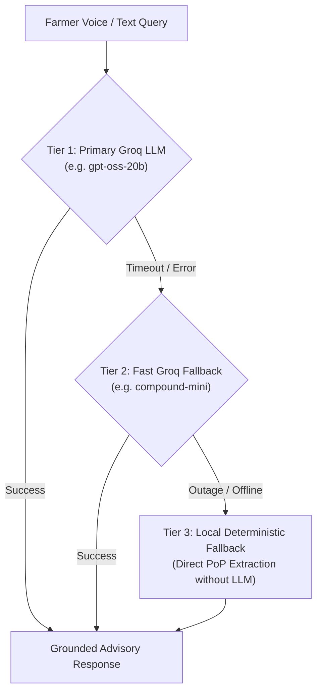

# JalSathi AI Explained

**JalSathi AI** (জলসাথী / जलसाथी = "Water Companion") is JalDrishti's voice-enabled agronomic virtual assistant. It allows farmers to ask complex questions regarding crop health, pest attacks, leaf diseases, and fertilizer schedules in their native vernacular language, receiving immediate, verified guidance.

---

## 🌟 Why Generic AI Chatbots Fail Indian Agriculture

Commercial LLMs (like ChatGPT or standard chatbots) are notoriously unreliable for rural Indian farmers:
1. **Pest & Chemical Hallucinations**: Generic LLMs frequently invent chemical names, mix up active ingredients, or recommend lethal over-dosages that can burn a farmer's crop or poison the soil.
2. **Language Gaps in Agronomy**: Translating nuanced agricultural symptoms between Bengali/Hindi dialects and English often scrambles technical terms (e.g., confusing "Stem Borer" with "Armyworm").
3. **The "Fabricated Confidence" Problem**: When an AI doesn't know the regional treatment for a disease, it usually guesses rather than admitting lack of information.

---

## 🏗️ The Rebuilt JalSathi Architecture (The Phase 5 Breakthrough)

In Phase 5 of system remediation, the JalSathi pipeline was completely redesigned and rebuilt as a **100% Groq-native, Retrieval-Augmented Generation (RAG)** pipeline backed by dense vector search and strict grounding rules.

```text
┌────────────────────────────────────────────────────────┐
│              JALSATHI AI 4-STEP RAG PIPELINE           │
└────────────────────────────────────────────────────────┘

 [1] FARMER SPEECH / TEXT INPUT (Bengali / Hindi / English)
     Example: "ধান গাছে বাদামী শোষক পোকা হলে কি করব?"
                           │
                           ▼
 [2] PRELIMINARY TRANSLATION (Fast Groq LLM Hop)
     Converts to English agronomy search terms:
     "Brown Planthopper in paddy rice symptoms and treatment"
                           │
                           ▼
 [3] DENSE VECTOR SEARCH (ChromaDB + all-MiniLM-L6-v2)
     - Embeds query into 384-dimensional dense vector
     - Queries ICAR Package of Practices (PoP) knowledge base
     - Filters by minimum similarity threshold (>= 0.35)
                           │
                           ▼
 [4] STRICT GROUNDED GENERATION & CHEMICAL GUARDRAIL
     - Synthesizes answer in target language script (বাংলা / हिंदी)
     - ONLY cites chemicals/dosages found in retrieved documents
     - Post-generation scanner strips ungrounded chemical names
```

---

## 🛡️ Key Pillars of the JalSathi Pipeline

### 1. English-to-Vernacular Bridge via Groq Translation
Because verified agricultural university guides (ICAR Package of Practices) are authored primarily in English, non-English vector searches historically yielded poor matches.  
JalSathi solves this by using a fast preliminary Groq hop to translate the farmer's vernacular query into concise English agronomic terms *before* searching the vector database. The final answer is then generated entirely in the farmer's native script (natural Bengali script বাংলা or Hindi Devanagari हिंदी).

### 2. Dense Vector Search with Strict Thresholds
The knowledge base contains verified ICAR Package of Practices documents for staple Indian crops (Paddy, Wheat, Potato, Maize, Mustard). Each guide is chunked into dense 384-dimensional embeddings stored in a persistent **ChromaDB** store.  
If a query does not match any document section with a cosine similarity of at least **0.35**, the system returns empty context. **It is always better to say "I don't have verified information on this" than to hallucinate.**

### 3. The Anti-Hallucination Chemical Guardrail
The system prompt contains strict safety constraints:
> *"Only state a chemical name and dosage if it explicitly appears in the SEMANTIC KNOWLEDGE BASE context. If the context does not contain a specific dosage, say so explicitly and advise the farmer to consult their local Krishi Vigyan Kendra (KVK) — do not invent or estimate a dosage."*

Furthermore, a post-generation verification function scans the generated response. If the model mentions an agrochemical active ingredient (e.g., *Cartap, Imidacloprid, Coragen*) that is not present in the retrieved university chunks, the chemical recommendation is automatically flagged and replaced with a safety referral to the local Block Agriculture Officer.

---

## ⚡ The 3-Tier Groq Fallback Cascade (Zero Gemini)

Earlier documentation claimed a fallback chain involving Google Gemini. During the technical audit, this was found to be non-existent. Today, the system implements a **genuine, verified 3-tier cascade**:



- **Tier 1 (Primary Groq LLM)**: Fast, high-capacity model (`openai/gpt-oss-20b` or configured primary) delivering sub-second conversational reasoning.
- **Tier 2 (Secondary Fast Groq LLM)**: Lightweight model (`groq/compound-mini`) that takes over instantly if Tier 1 encounters rate limits or upstream timeouts.
- **Tier 3 (Local Deterministic Fallback)**: If the cloud API is completely unreachable or offline, the system does not crash or show a blank screen. It directly formats the retrieved ICAR PoP text chunks into a structured template without any LLM, providing safe, verified advice even during network crises.

---

## 🛠️ For Technical Readers

The JalSathi AI architecture is implemented in:
- **Vector Retrieval & Embeddings**: In [`app/services/vector_search_service.py`](file:///d:/jaldrishti/jaldrishti-backend/app/services/vector_search_service.py).
- **RAG Orchestrator & Guardrails**: In `RAGService` inside [`app/services/rag_service.py`](file:///d:/jaldrishti/jaldrishti-backend/app/services/rag_service.py).
- **PoP Ingestion Pipeline**: In [`app/scripts/ingest_pop_docs.py`](file:///d:/jaldrishti/jaldrishti-backend/app/scripts/ingest_pop_docs.py).
- **Mobile Audio & Chat Client**: In [`jaldrishti_mobile/lib/providers/chat_provider.dart`](file:///d:/jaldrishti/jaldrishti_mobile/lib/providers/chat_provider.dart).
