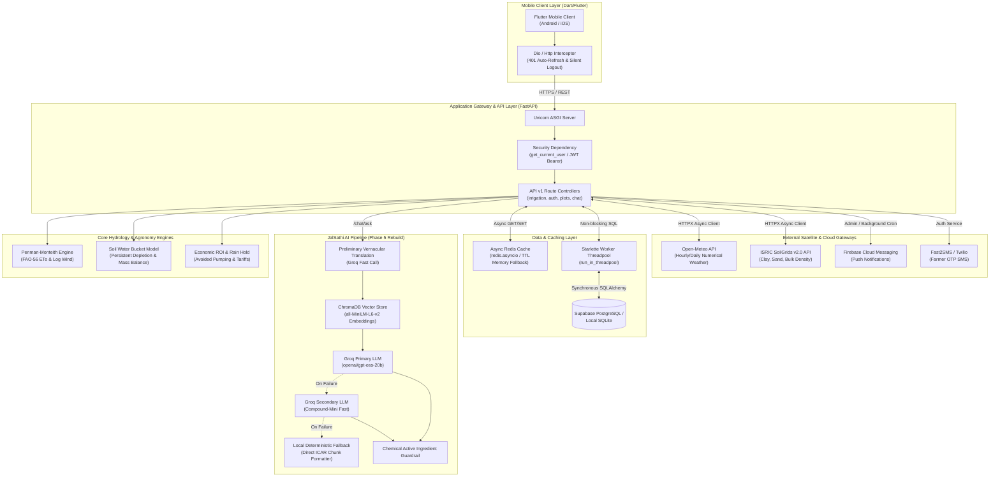

# High-Level System Architecture

> **Audience**: Solution architects, backend engineers, and systems integrators.  
> **Source Verification**: Grounded in current code across [`jaldrishti-backend/`](file:///d:/jaldrishti/jaldrishti-backend/) and [`jaldrishti_mobile/`](file:///d:/jaldrishti/jaldrishti_mobile/) post Phases 1–6.

---

## 1. System Topology Diagram

The following diagram illustrates the verified end-to-end topology of JalDrishti. 

> [!NOTE]
> **No Fictitious Fallback Boxes**: Unlike legacy diagrams that depicted an unused Google Gemini API, this architecture represents the **actual 100% Groq-native RAG pipeline** and async caching infrastructure validated in Phases 4 and 5.

---

## 2. Component Specifications

### 1. Mobile Client (`jaldrishti_mobile/`)
- **Technology**: Flutter 3.x (Dart 3.x)
- **State Management**: Provider architecture (`AuthProvider`, `FarmPlotProvider`, `ThemeProvider`, `LanguageProvider`)
- **Network Pipeline**: Centralized `ApiService` with automatic token refresh, localized error handling, and silent logout on revoked sessions (Phase 3).
- **Localization**: Native support for English (`en`), Bengali (`bn`), and Hindi (`hi`).

### 2. Application Backend (`jaldrishti-backend/`)
- **Framework**: FastAPI with Pydantic v2 schemas and Uvicorn ASGI runner.
- **Security Architecture**:
  - JWT Access Tokens (HS256) signed with required environment secret key (`JWT_SECRET_KEY`).
  - Mandatory dependency injection (`Depends(get_current_user)`) protecting all operational routes (Phase 2).
  - Strict admin key validation requiring environment variable `ADMIN_API_KEY`. The server refuses to boot if unconfigured.
- **Concurrency Architecture**:
  - Asynchronous HTTP route handlers (`async def`).
  - Non-blocking Redis caching via `redis.asyncio` (Phase 4).
  - Asynchronous worker offloading (`run_in_threadpool`) for blocking database transactions (Phase 4).

### 3. Data Persistence
- **Production Database**: Supabase PostgreSQL managed via SQLAlchemy ORM and Alembic migrations.
- **Local Dev Database**: SQLite (`sqlite:///./jaldrishti.db`).
- **Vector Database**: ChromaDB 1.5.9 running in embedded persistent SQLite mode (`PersistentClient`), storing 384-dimensional `all-MiniLM-L6-v2` dense embeddings under `app/data/chroma_db` (Phase 5).

### 4. External Satellite & Service Integrations
| Gateway | Role | Integration Mechanism | Resilience Mechanism |
|:--------|:-----|:----------------------|:---------------------|
| **Open-Meteo API** | Real-time & forecast meteorological parameters ($T_{\text{max}}, T_{\text{min}}, RH, R_s, u_{10}, P$) | Async `httpx.AsyncClient` | 3-hour Redis cache TTL (`weather:{lat}:{lon}`); stale-while-revalidate fallback; circuit breaker. |
| **ISRIC SoilGrids v2.0** | Soil textural fractions ($\% \text{clay}, \% \text{sand}$) | Async `httpx.AsyncClient` | 30-day Redis cache TTL (`soil_grid:{lat}:{lon}`); $0.05^\circ$ grid coarsening; 15-minute circuit breaker; regional Gangetic Alluvium fallback. |
| **Groq Cloud API** | Fast LLM inference for multilingual translation and agronomic advice | Async HTTP API | Two-tier cascade (`openai/gpt-oss-20b` $\to$ fast model $\to$ local deterministic chunk formatter). |
| **Firebase Cloud Messaging** | Automated morning weather & pest advisory push notifications | `firebase-admin` SDK | Geo-clustered query aggregation; bounded concurrency with `asyncio.Semaphore(20)`. |
| **Fast2SMS / Twilio** | SMS-based OTP phone verification for farmer onboarding | REST API | Development OTP logging toggle (`ENABLE_DEV_OTP_LOGS`) for staging environments. |
