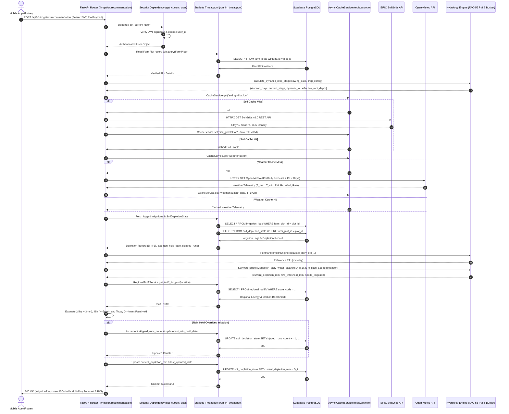

# Request Lifecycle: Irrigation Recommendation Endpoint

> **Audience**: Backend engineers and integration testers. For a farmer-facing narrative of this workflow, see [End-to-End Farmer Journey](../01-concepts-and-workflows/end-to-end-farmer-journey.md).  
> **Route Inspected**: `POST /api/v1/irrigation/recommendation`  
> **Primary File**: [`app/api/v1/endpoints/irrigation.py:100-580`](file:///d:/jaldrishti/jaldrishti-backend/app/api/v1/endpoints/irrigation.py#L100-L580)

---

## 1. End-to-End Sequence Diagram

The following sequence diagram traces the complete execution flow of an incoming irrigation advisory request through the remediated Phase 1–5 backend:



---

## 2. Step-by-Step Execution Trace with Code Pointers

### Step 1: Authentication & Authorization (Phase 2)
- **Code Pointer**: [`app/api/v1/endpoints/irrigation.py:107`](file:///d:/jaldrishti/jaldrishti-backend/app/api/v1/endpoints/irrigation.py#L107)
- **Action**: Injected dependency `current_user: User = Depends(get_current_user)` parses the `Authorization: Bearer <token>` header, decodes the HS256 JWT signature using `settings.JWT_SECRET_KEY`, and verifies that the account is active. Requests missing or with expired tokens return HTTP `401 Unauthorized` before any hydrological calculation executes.

### Step 2: Ownership Verification & Threadpool Offloading (Phase 4)
- **Code Pointer**: [`app/api/v1/endpoints/irrigation.py:113-125`](file:///d:/jaldrishti/jaldrishti-backend/app/api/v1/endpoints/irrigation.py#L113-L125)
- **Action**: Verifies that the requested `plot_id` belongs to `current_user.id`. To prevent blocking the async event loop during database I/O, the synchronous SQLAlchemy query is wrapped in:
  ```python
  plot = await run_in_threadpool(
      lambda: db.query(FarmPlot).filter(
          FarmPlot.id == payload.plot_id,
          FarmPlot.user_id == current_user.id
      ).first()
  )
  ```

### Step 3: Phenological Stage Calculation
- **Code Pointer**: [`app/engine/water_bucket_model.py:19-132`](file:///d:/jaldrishti/jaldrishti-backend/app/engine/water_bucket_model.py#L19-L132)
- **Action**: Evaluates sowing date versus today's date. If the crop is within active lifecycle, interpolates $K_c(t)$ and root depth $Z_r(t)$. If $t < 0$, early-returns with `crop_lifecycle_status = "NOT_YET_SOWN"`. If $t > L_{\text{total}} + 15$, early-returns with `crop_lifecycle_status = "HARVEST_OVERDUE"`.

### Step 4: Asynchronous Cache-First Data Fetching (Phase 4)
- **SoilGrids Profiling**: [`app/services/soilgrids_service.py:54-138`](file:///d:/jaldrishti/jaldrishti-backend/app/services/soilgrids_service.py#L54-L138) queries Redis with key `soil_grid:{lat}:{lon}` ($0.05^\circ$ grid). On miss, queries ISRIC SoilGrids REST API with circuit-breaker protection and sets a 30-day TTL ($2,592,000\text{ s}$).
- **Open-Meteo Weather**: [`app/services/weather_service.py:23-138`](file:///d:/jaldrishti/jaldrishti-backend/app/services/weather_service.py#L23-L138) queries Redis with key `weather:{lat}:{lon}` ($0.01^\circ$ grid). On miss, queries Open-Meteo daily forecast and sets a 3-hour TTL ($10,800\text{ s}$).

### Step 5: Persistent State Retrieval & Mass Balance (Phase 1)
- **Code Pointer**: [`app/api/v1/endpoints/irrigation.py:262-375`](file:///d:/jaldrishti/jaldrishti-backend/app/api/v1/endpoints/irrigation.py#L262-L375)
- **Action**: Reads `SoilDepletionState` for the plot. If `last_updated_date < today`, uses `current_depletion_mm` as baseline $D_{i-1}$. Executes:
  $$D_i = D_{i-1} - P_{\text{eff}} - I_{\text{applied}} + ET_c$$
  Clamps $D_i \in [0, TAW]$. If $D_i \ge RAW$, flags `needs_irrigation = True`.

### Step 6: Rain Hold Override & ROI Tracking (Phase 1)
- **Code Pointer**: [`app/api/v1/endpoints/irrigation.py:460-555`](file:///d:/jaldrishti/jaldrishti-backend/app/api/v1/endpoints/irrigation.py#L460-L555)
- **Action**: Inspects weather forecast. If $P_{24\text{h}} \ge 3\text{ mm}$ or $P_{48\text{h}} \ge 5\text{ mm}$ or $P_{\text{today}} \ge 4\text{ mm}$:
  - Activates Smart Rain Hold.
  - If irrigation was needed, suppresses `needs_irrigation_today` to `False`.
  - Increments `skipped_runs_count` once per calendar day (gated by `last_rain_hold_date`).
  - Calculates avoided pumping hours, monetary cost savings, and avoided $CO_2$ emissions.

### Step 7: Persistence Commit & JSON Response
- **Code Pointer**: [`app/api/v1/endpoints/irrigation.py:363-375`](file:///d:/jaldrishti/jaldrishti-backend/app/api/v1/endpoints/irrigation.py#L363-L375)
- **Action**: Commits updated $D_i$ and `last_updated_date` to the database via `run_in_threadpool`. Returns the serialized Pydantic `IrrigationResponse` with a 7-day visualization forecast to the client.
