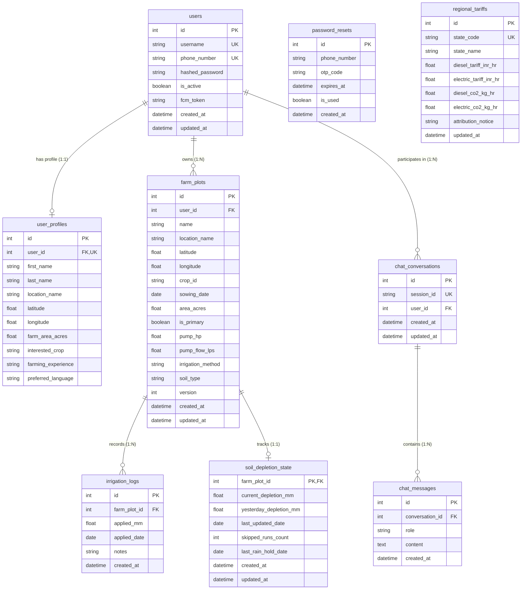

# Entity-Relationship Diagram (ERD)

> **Audience**: Database administrators, backend developers, and data architects.  
> **Source Verification**: Derived directly from SQLAlchemy models in [`app/models/user.py`](file:///d:/jaldrishti/jaldrishti-backend/app/models/user.py), [`app/models/farm_plot.py`](file:///d:/jaldrishti/jaldrishti-backend/app/models/farm_plot.py), [`app/models/regional_tariff.py`](file:///d:/jaldrishti/jaldrishti-backend/app/models/regional_tariff.py), and [`app/models/chat_history.py`](file:///d:/jaldrishti/jaldrishti-backend/app/models/chat_history.py).

---

## 1. Complete System ERD

The following diagram captures the complete, corrected schema of the JalDrishti relational database.

> [!NOTE]
> **Audit Corrections Incorporated**:
> 1. Restored the **four tables omitted from legacy diagrams**: `password_resets`, `regional_tariffs`, `chat_conversations`, and `chat_messages`.
> 2. Added the **Phase 1 persistent depletion table**: `soil_depletion_state`.
> 3. Verified all field names, primary keys, and foreign keys against the active Python code.

---

## 2. Table Relationship Matrix

| Parent Table | Relationship | Child Table | Foreign Key | Cascade Behavior | Business Rule |
|:-------------|:-------------|:------------|:------------|:-----------------|:--------------|
| `users` | 1-to-1 | `user_profiles` | `user_profiles.user_id` | `cascade="all, delete-orphan"` | Every farmer has exactly one profile specifying personal and regional defaults. |
| `users` | 1-to-Many | `farm_plots` | `farm_plots.user_id` | Enforced at DB level | A farmer can own and manage multiple distinct agricultural plots. |
| `users` | 1-to-Many | `chat_conversations` | `chat_conversations.user_id` | Enforced at DB level | Farmer chat sessions are tied to the user account for persistent history. |
| `farm_plots` | 1-to-Many | `irrigation_logs` | `irrigation_logs.farm_plot_id` | `cascade="all, delete-orphan"` | Each plot accumulates historical irrigation applications logged by the farmer. |
| `farm_plots` | 1-to-1 | `soil_depletion_state` | `soil_depletion_state.farm_plot_id` | `ondelete="CASCADE"` | Exactly one persistent soil moisture tracker exists per plot. Deleting the plot purges the tracker. |
| `chat_conversations` | 1-to-Many | `chat_messages` | `chat_messages.conversation_id` | `cascade="all, delete-orphan"` | Individual conversation rounds are ordered chronologically by `created_at ASC`. |
| Standalone | N/A | `password_resets` | None (keyed by `phone_number`) | Retained until expiry | Transient OTP storage for phone-based credential recovery. |
| Standalone | N/A | `regional_tariffs` | None (keyed by `state_code`) | Managed by Admin | Looked up via geospatial coordinates or location text to apply localized economic factors. |
