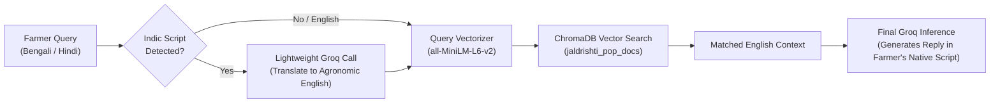

# Multilingual Query Translation Step

> **Audience**: NLP engineers, multilingual AI developers, and system architects.  
> **Source Implementation**: [`app/services/rag_service.py:151-190`](file:///d:/jaldrishti/jaldrishti-backend/app/services/rag_service.py#L151-L190)  
> **Remediation Provenance**: Phase 5 Rebuild ([`PHASE5_CHANGELOG.md`](file:///d:/jaldrishti/PHASE5_CHANGELOG.md)).

---

## 1. The Cross-Lingual Semantic Retrieval Challenge

Official agricultural Package of Practices (PoP) guidelines published by ICAR, state universities, and chemical regulatory boards in India are predominantly documented in technical English. However, smallholder farmers predominantly formulate queries in regional Indic scripts (such as Bengali বাংলা or Hindi हिंदी).

Standard English-trained sentence-transformer models (`all-MiniLM-L6-v2`) exhibit severe embedding alignment degradation when comparing Indic script text directly against English technical documents, producing low similarity scores and poor retrieval accuracy.

---

## 2. Implementation: The Fast Groq Translation Hop

To bridge this language gap without introducing heavy multilingual models or paid external translation APIs, Phase 5 introduced an intermediate translation step executed via a sub-150ms Groq LLM call:



### Detection Logic
Implemented in [`rag_service.py:157-159`](file:///d:/jaldrishti/jaldrishti-backend/app/services/rag_service.py#L157-L159):
```python
is_indic = any(
    '\u0900' <= char <= '\u097F' or  # Devanagari (Hindi)
    '\u0980' <= char <= '\u09FF'      # Bengali script
    for char in query
)
if not is_indic and language.strip().lower() == "english":
    return query
```
If the query contains no Indic unicode characters and language is English, translation is bypassed immediately ($0\text{ ms}$ overhead).

### Translation Prompt Specification
```python
# app/services/rag_service.py:169-178
resp = await self.client.chat.completions.create(
    model=settings.GROQ_MODEL_NAME or "openai/gpt-oss-20b",
    messages=[
        {
            "role": "system",
            "content": (
                "You are an agricultural translation assistant. "
                "Translate the following farmer query into clear, concise English agronomic search terms. "
                "Output ONLY the English translation, without explanation or quotes."
            )
        },
        {
            "role": "user",
            "content": query
        }
    ],
    temperature=0.1
)
```

---

## 3. Real-World Execution Examples

### Test 1: Bengali Query (Brown Planthopper)
- **Raw User Input**: `"ধান গাছে বাদামী শোষক পোকা (BPH) হলে কী ওষুধ দেব?"`
- **Groq Translation Output**: `"What medicine should be given if there is brown planthopper (BPH) on rice plants?"`
- **ChromaDB Top Hit**: `[Paddy Rice - 2. PEST & DISEASE CONTROL]` (Cosine Similarity: `0.7842`)
- **Extracted Treatment**: Triflumezopyrim 10% SC @ 94 ml/acre or Pymetrozine 50% WG @ 120 g/acre.
- **Final LLM Generation**: Responds entirely in natural Bengali script (বাংলা) explaining application methods and cultural water management.

### Test 2: Hindi Query (Stem Borer)
- **Raw User Input**: `"धान में तना छेदक के लिए कौन सी दवा डालें?"`
- **Groq Translation Output**: `"Which medicine should be applied for stem borer in paddy?"`
- **ChromaDB Top Hit**: `[Paddy Rice - 2. PEST & DISEASE CONTROL]` (Cosine Similarity: `0.7490`)
- **Final LLM Generation**: Responds entirely in natural Hindi Devanagari script (हिंदी).

---

## 4. Architectural Trade-offs & Open Questions

| Architectural Decision | Chosen Approach | Alternative Evaluated | Why Chosen |
|:-----------------------|:----------------|:----------------------|:-----------|
| **Translation Engine** | In-pipeline Groq Call | Google Cloud Translation API | Eliminates third-party billing, external SDK dependencies, and API credentials. |
| **Embedding Strategy** | `all-MiniLM-L6-v2` with English translation | Multilingual model (`LaBSE` or `multilingual-e5`) | Multilingual models require 1.2–2.5 GB of RAM, exceeding the 512 MB memory boundary of free cloud tiers. `all-MiniLM-L6-v2` requires only ~120 MB RAM. |

> [!NOTE]
> **Open Roadmap Enhancement**:
> An open question flagged during Phase 5 is whether future releases should translate and ingest the ICAR Package of Practices documents directly into native Bengali and Hindi collections (`jaldrishti_pop_docs_bn`, `jaldrishti_pop_docs_hi`). Doing so would eliminate the preliminary translation step entirely, reducing query latency by 120–180ms.
